# Viecz — Location-Based Micro-Task Marketplace for Students

[](https://github.com/nhannht/viecz/actions/workflows/server-tests.yml)
[](https://github.com/nhannht/viecz/actions/workflows/web-tests.yml)
[](LICENSE)

> A two-sided marketplace connecting students who need help with students ready to work, powered by real-time location and escrow payments.

**Live:** [viecz.fishcmus.io.vn](https://viecz.fishcmus.io.vn) · **User Guide:** [/howtouse](https://viecz.fishcmus.io.vn/howtouse)

<p align="center">
  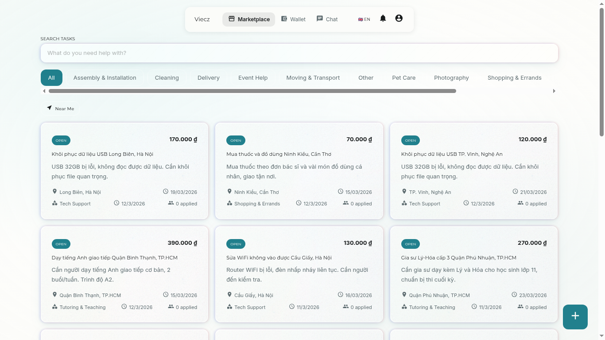
</p>

## The Problem

Vietnam has over 2.15 million university students [[1]](#references). Around 22% do side work [[3]](#references), but existing options don't serve **micro-tasks** — the 15-minute to few-hour jobs that happen every day on campus:

- Need someone to carry furniture up to the dorm — 30 min, 50,000 VND, but no way to find help *right now*
- Need English speaking practice before an exam — don't need a 200,000 VND/hr tutor, just a fellow student for 30 min

These needs repeat daily across every campus, but today students only have Zalo groups (messages get buried, no payments, no trust system) or asking friends (limited reach, social pressure). No platform in Vietnam combines real-time location matching, domestic escrow payments, and a student-focused experience for micro-tasks.

## How It Works

```
┌──────────────┐    ┌──────────────┐    ┌──────────────┐    ┌──────────────┐
│  Post a task │───▶│  Discover    │───▶│  Apply &     │───▶│  Escrow      │
│  (30 sec)    │    │  on the map  │    │  Chat        │    │  payment     │
└──────────────┘    └──────────────┘    └──────────────┘    └──────────────┘
 Description,        Students nearby     View profiles,      Funds held
 location, price     see it instantly    negotiate details   until job done
```

1. **Post a task** — Describe what you need, pick a location on the map, set a price and deadline. Under 30 seconds.
2. **Discover nearby** — Tasks appear on a real-time map. Filter by category, search by keyword, or browse the list.
3. **Apply & chat** — Send an intro message, optionally negotiate the price. Real-time WebSocket chat after acceptance.
4. **Escrow payment** — Money is held via PayOS (Vietnamese bank transfer) until the poster confirms completion. No international card needed.

### Task Categories

| Category | Examples | Price Range |
|----------|----------|-------------|
| Errands | Printing, delivery, grocery runs, saving library seats | 5,000–30,000 VND |
| Academic | Speaking practice, slide design, CV review, translation | 30,000–200,000 VND |
| Skills | Photography, video editing, graphic design, IT support | 50,000–500,000 VND |
| Daily life | Dorm cleanup, late-night food delivery, bike repair | 20,000–100,000 VND |

## Screenshots

<table>
  <tr>
    <td>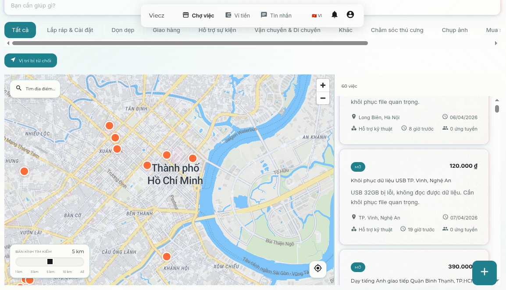<br/><em>Map view — tasks near you</em></td>
    <td>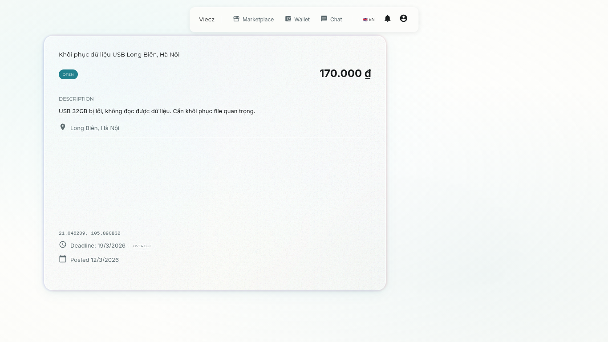<br/><em>Task detail with applicants</em></td>
  </tr>
  <tr>
    <td>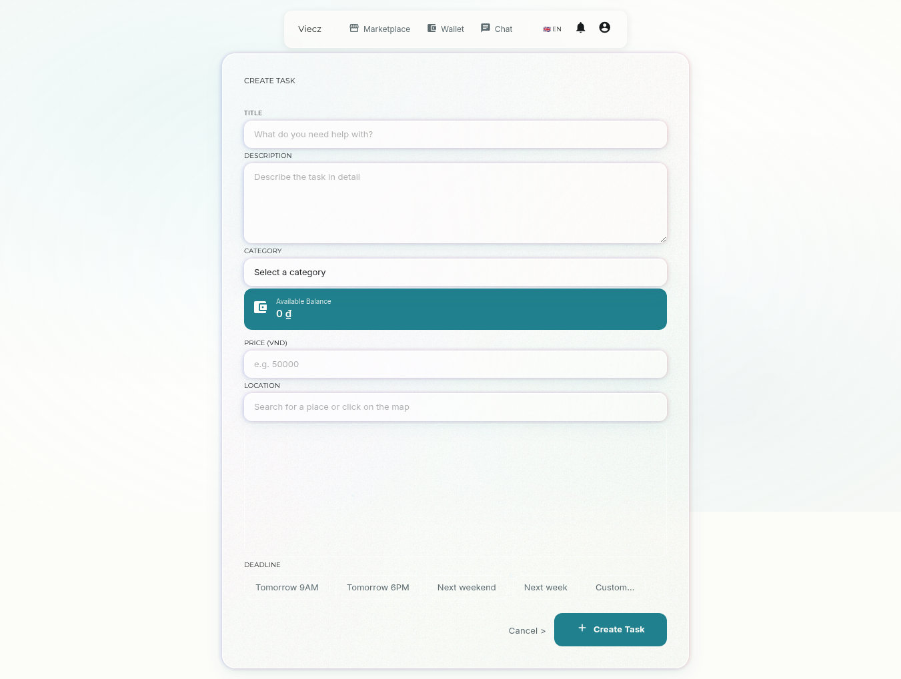<br/><em>Post a task in 30 seconds</em></td>
    <td>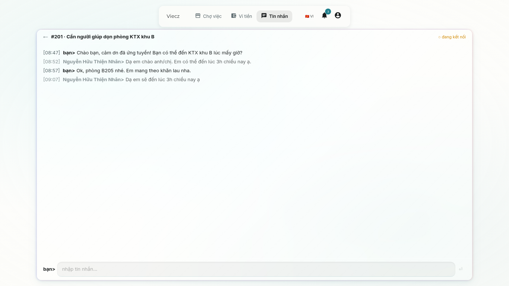<br/><em>Real-time messaging</em></td>
  </tr>
  <tr>
    <td>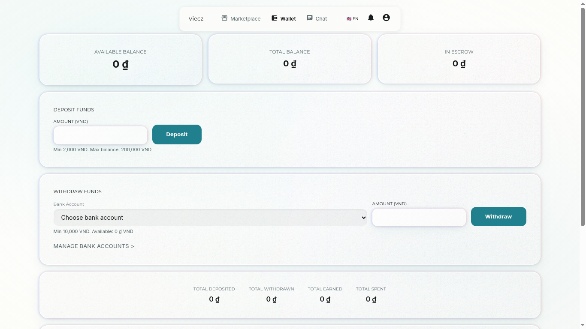<br/><em>Wallet with escrow</em></td>
    <td>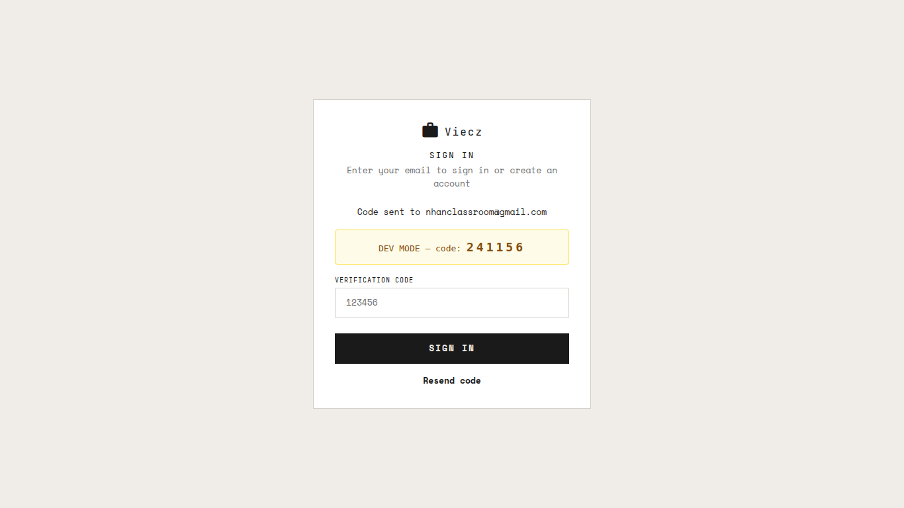<br/><em>Passwordless OTP login</em></td>
  </tr>
</table>

<details>
<summary>Mobile views</summary>
<table>
  <tr>
    <td>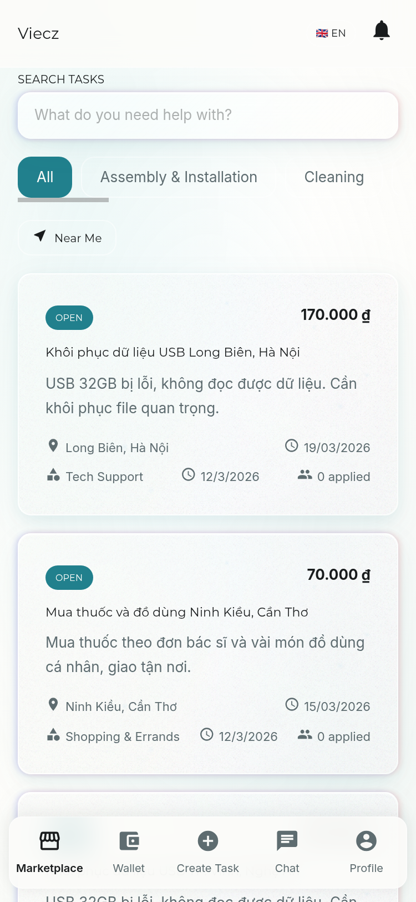</td>
    <td>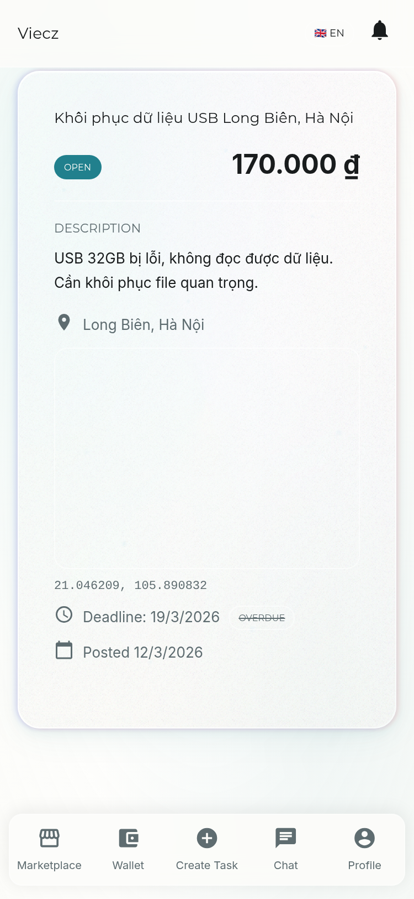</td>
    <td>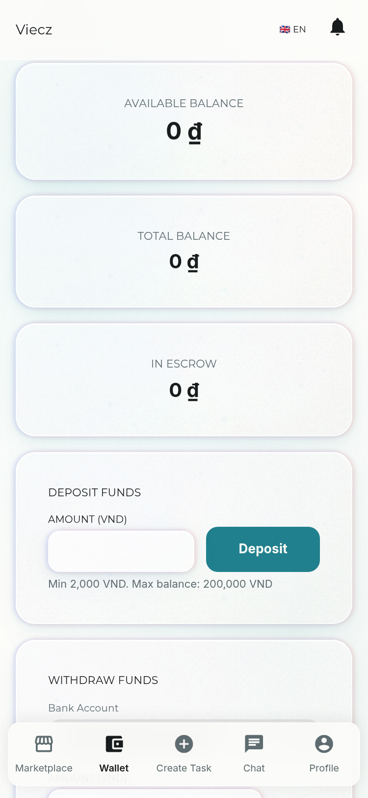</td>
    <td>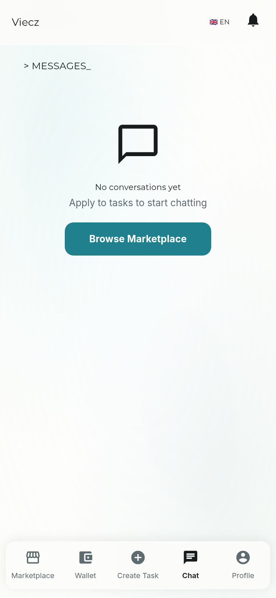</td>
  </tr>
</table>
</details>

## Architecture

```
         Cloudflare (CDN + DDoS)
                  │
       ┌──────────┼──────────┐
       ▼                     ▼
  Angular 21 (SSR)    Mobile (Capacitor)
       │                     │
       └──────────┬──────────┘
                  ▼
          Go API (Gin)  ◄── WebSocket
          │       │       │
          ▼       ▼       ▼
      PostgreSQL  Meilisearch  PayOS
```

| Component | Technology | Role |
|-----------|-----------|------|
| Backend API | Go (Gin) | Business logic, REST API, handles thousands of concurrent connections |
| Database | PostgreSQL | Transactional data with ACID guarantees |
| Search | Meilisearch | Full-text search with typo tolerance for quick mobile searches |
| Web | Angular 21 (SSR) | Server-Side Rendering for fast loads and SEO. Responsive. |
| Mobile | Ionic/Capacitor | Android wrapper for the Angular web app |
| Payments | PayOS | Vietnamese payment gateway — domestic bank transfers |
| Chat | WebSocket | Real-time messaging between matched users |
| Maps | MapLibre + MapTiler | Interactive maps with location-based task discovery |
| Monitoring | GlitchTip + Prometheus | Error tracking and performance metrics |
| Bot | discord.py + FastAPI | Discord notifications ([Jellyfish](https://github.com/nhannht/jellyfish) submodule) |

## Getting Started

### Prerequisites

- Go 1.25+
- Bun (for Angular + Capacitor)
- PostgreSQL 15+
- Docker (for Meilisearch)

### Development Setup

```bash
# Clone with submodules
git clone --recurse-submodules https://github.com/nhannht/viecz.git
cd viecz

# Start test databases
docker compose -f docker-compose.testdb.yml up -d

# Backend
cd server
cp .env.example .env.dev          # edit with your local values
set -a && source .env.dev && set +a
go run cmd/server/main.go         # API on :9999

# Frontend (separate terminal)
cd web
bun install
bunx ng serve                     # http://localhost:4200, proxies to :9999

```

> **Note:** `source .env.dev` alone won't export variables. Always use `set -a && source .env.dev && set +a`.

### Running Tests

```bash
cd server && go test ./...                    # Go tests
cd web && bunx ng test                        # Angular tests
cd server && golangci-lint run ./...           # Go linting
cd web && bunx eslint 'src/**/*.ts'           # TS linting
```

## User Guide

> **Full interactive guide with screenshots:** [viecz.fishcmus.io.vn/howtouse](https://viecz.fishcmus.io.vn/howtouse)

Quick overview:

1. **Login** — Enter email, receive 6-digit OTP, done. No password needed.
2. **Browse** — Marketplace cards or map view. Filter by 11 categories. Tap "Near me" for location-based discovery.
3. **Post** — Title, description, category, price, map pin, deadline. 30 seconds.
4. **Apply** — Intro message + optional counter-offer. Poster gets notified instantly.
5. **Chat** — Real-time WebSocket messaging after acceptance.
6. **Pay** — Deposit via PayOS (QR/bank transfer, min 2,000 VND). Escrow holds funds until job confirmed complete.
7. **Complete** — Poster confirms → funds release to worker's wallet. Rate each other.

## Why Viecz?

| | Zalo Groups | Grab/Gojek | TaskRabbit (US) | **Viecz** |
|---|---|---|---|---|
| Location matching | No | Transport only | By area | **Real-time map** |
| Escrow payments | No | Internal only | Int'l card required | **VN bank transfer** |
| Diverse micro-tasks | Unstructured | No | Yes | **Yes** |
| Student-focused | No | No | No | **Yes** |
| Transaction fee | 0% | N/A | 22.5% | **10–15%** |
| Active in Vietnam | Yes | Yes | No | **Yes** |

## Team

| Name | Role |
|------|------|
| **Nguyen Huu Thien Nhan** | Team lead — Software architect. Designed and built the full stack (backend, web, mobile, infrastructure). |
| **Truong Hoai Duc** | Market research — Business development. User surveys, go-to-market strategy, university partnerships. |
| **Thai Kha Bao** | UX/UI design — Brand identity. Interface design, user experience, visual identity system. |
| **Tran Gia Sang** | QA — Quality assurance. Feature testing, user feedback collection, pre/post-launch quality. |

## Roadmap

| Phase | Timeline | Status |
|-------|----------|--------|
| MVP — all 7 core features | Oct 2025 – Feb 2026 | Done |
| Pilot at VNUHCM — University of Science | Semester 2/2026 (Mar–Jun) | In progress |
| Evaluate & iterate based on pilot data | Jul–Aug 2026 | Planned |
| Expand to nearby universities in HCMC | Semester 1/2027 | Planned |

**Pilot target:** 200–500 registered users, ≥50 completed transactions, ≥80% completion rate in 3 months.

## Competition Entry

Submission to **HCMUS I&E 2025** (Cuộc thi Sáng tạo — Khởi nghiệp), VNUHCM — University of Science.

- **Field:** Information Technology — AI — Digital Transformation
- **Round 1 (Registration):** Dec 2025 – Mar 2026
- **Round 2 (Preliminary):** Apr 2026
- **Round 3 (Mentorship):** Apr–May 2026
- **Round 4 (Finals):** Late May 2026

Full project description (Vietnamese): [`docs/general/THÔNG TIN CUỘC THI/`](docs/general/THÔNG%20TIN%20CUỘC%20THI/)

## References

1. Statista, "Number of university students in Vietnam 2013–2021," Feb 2024.
2. VietnamNet, "Zalo's number of users hits 78.3 million," Aug 2025.
3. GSO Vietnam, Labour Force Survey — 22.1% of university students do side work (2018).
4. Global Angle, "Vietnam's Education Sector 2025" — 243 universities (176 public, 67 private).
5. StatCounter, "Mobile OS market share Vietnam 2024" — Android 65.7%, iOS 33.7%.
6. C. Tian et al., "A Cross-platform Errand Service Application for Campus," IEEE ICSESS 2022.
7. InfoStride, "TaskRabbit Business and Revenue Model," May 2025 — 15% commission + 7.5% trust fee.

## License

[AGPL-3.0](LICENSE). Third-party dependencies have their own licenses.

---

Built at [VNUHCM — University of Science](https://hcmus.edu.vn/) · 2026
