*Generated by Claude*

# Viecz — User Flows

## Route Map

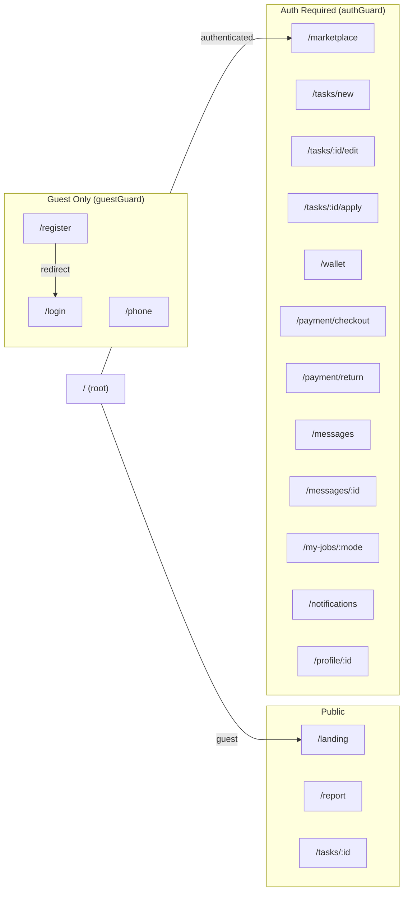

## Auth Flow — Email OTP (Primary)

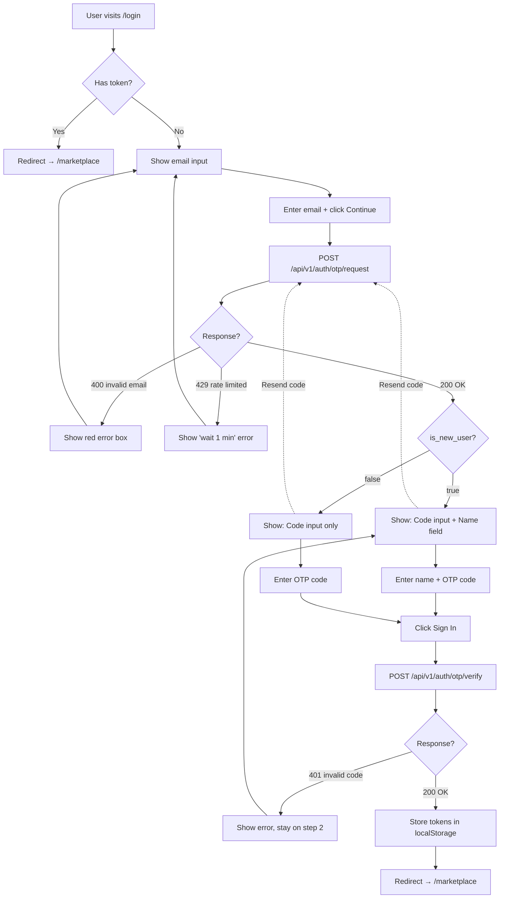

## Auth Flow — Phone Login (Supplementary)

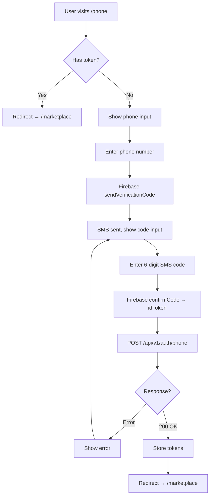

## Core User Journey — Task Poster

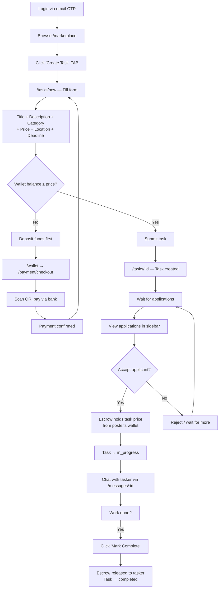

## Core User Journey — Task Applicant

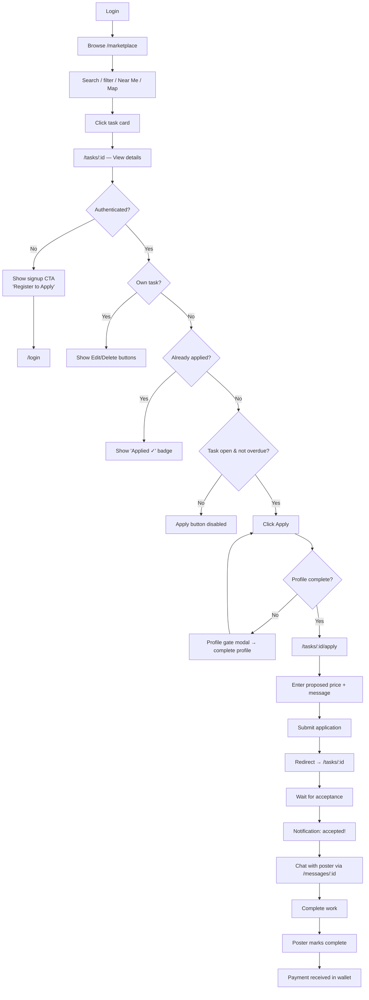

## Payment Flow — Deposit

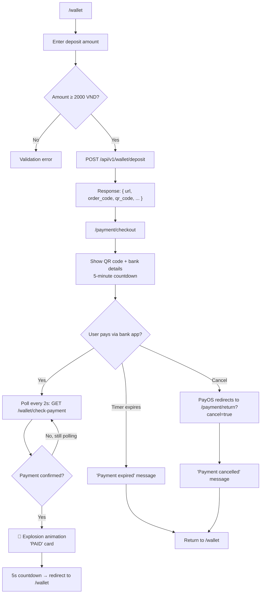

## Payment Flow — Withdrawal

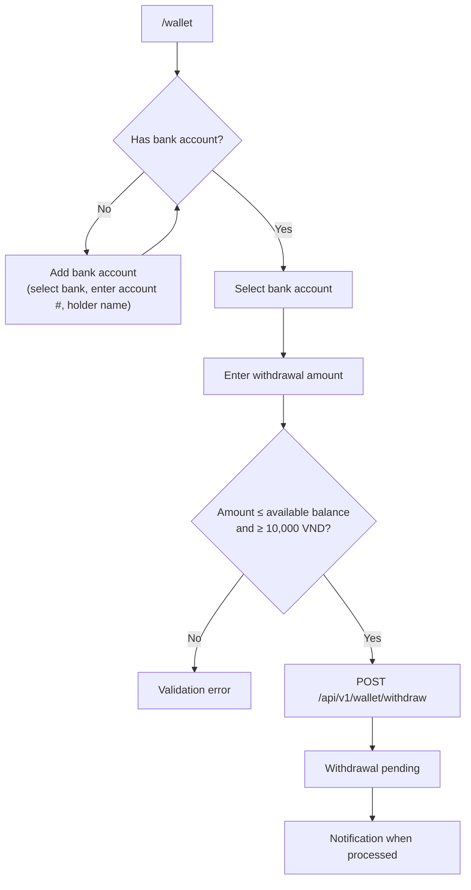

## Messaging Flow

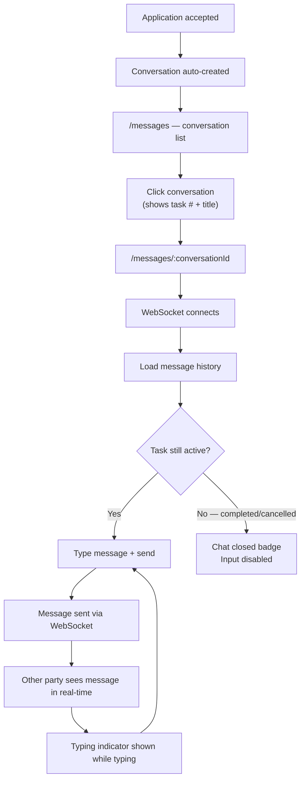

## Navigation Structure

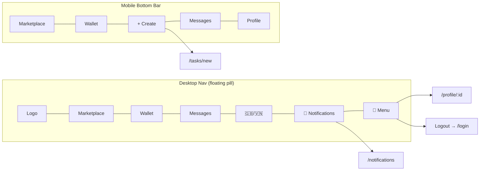

## Wallet Balance Model

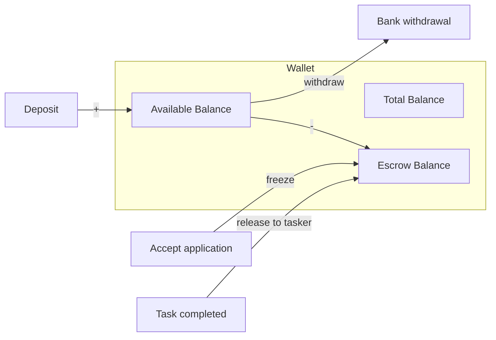

## Conditional UI Logic

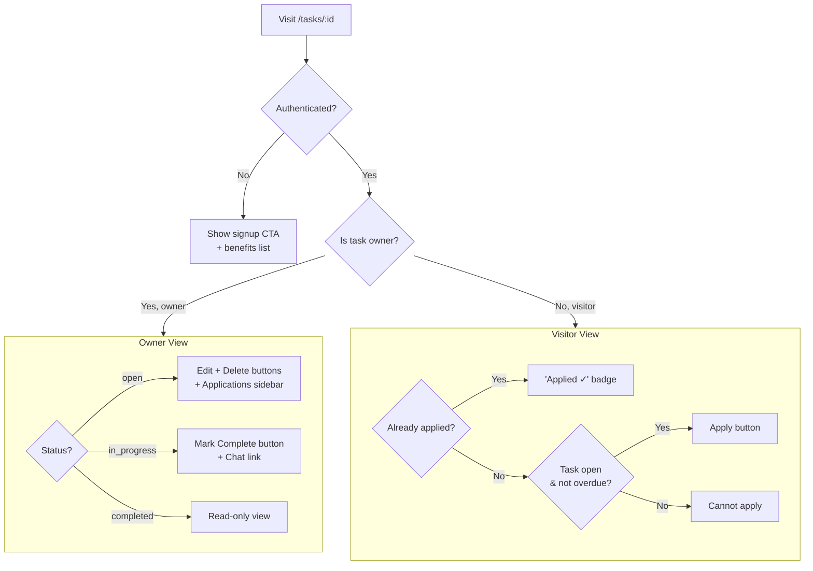

## Notification Types

| Type | Icon | Trigger |
|------|------|---------|
| `task_created` | post_add | New task created |
| `application_received` | person_add | Someone applied to your task |
| `application_sent` | send | Your application was sent |
| `application_accepted` | check_circle | Your application was accepted |
| `application_rejected` | cancel | Your application was rejected |
| `task_completed` | task_alt | Task marked complete |
| `payment_received` | payments | Payment credited to wallet |
| `message` | chat | New chat message |
| `task_cancelled` | block | Task was cancelled |
