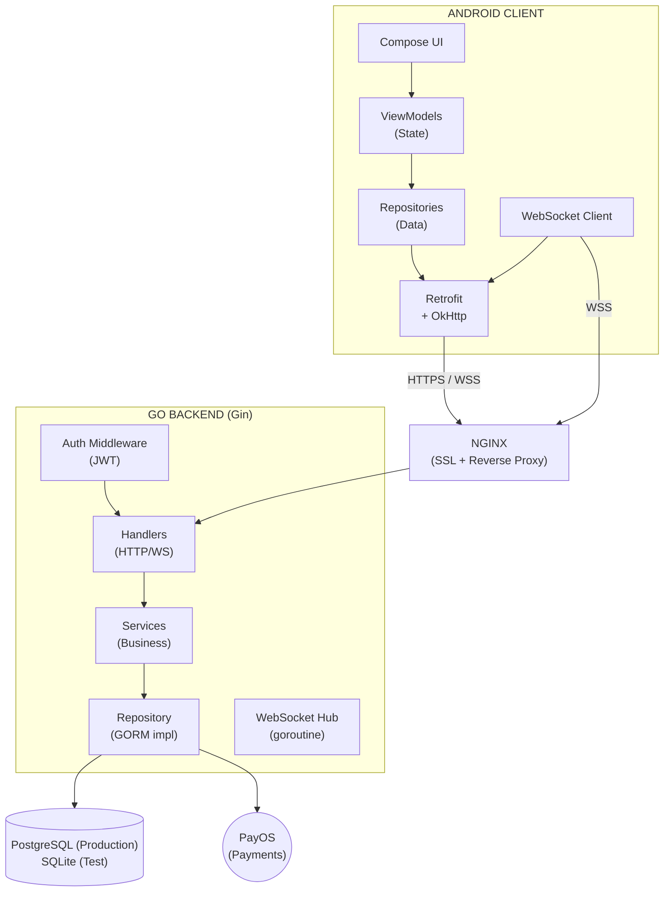
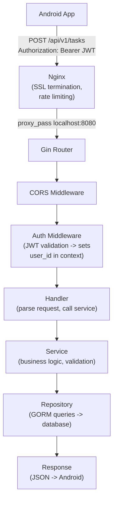
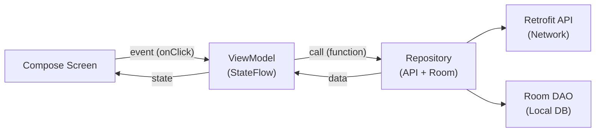
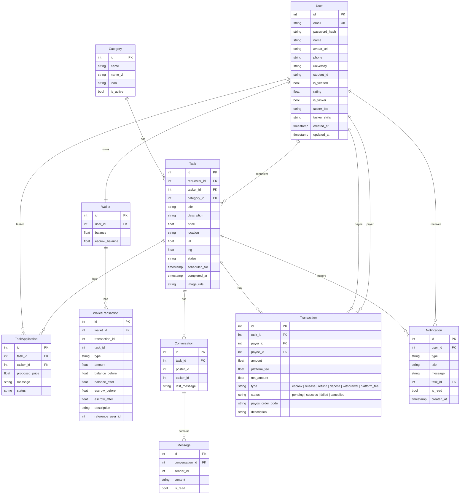
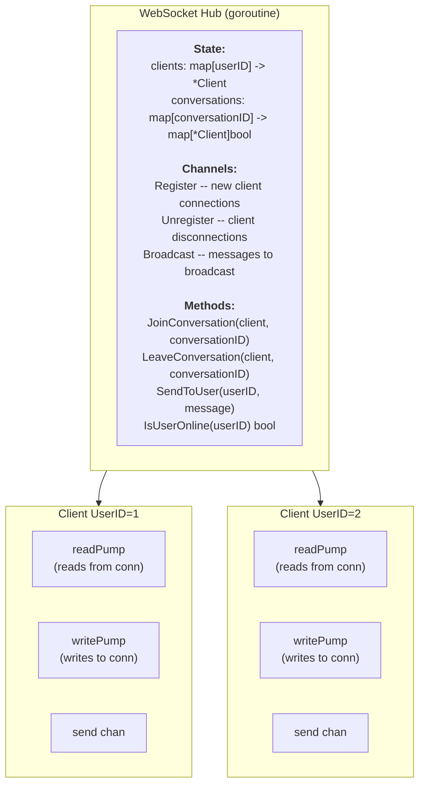
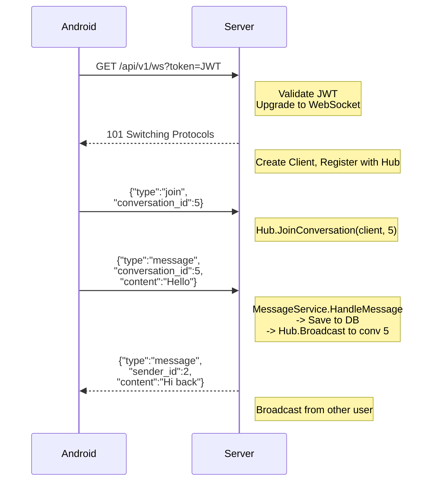
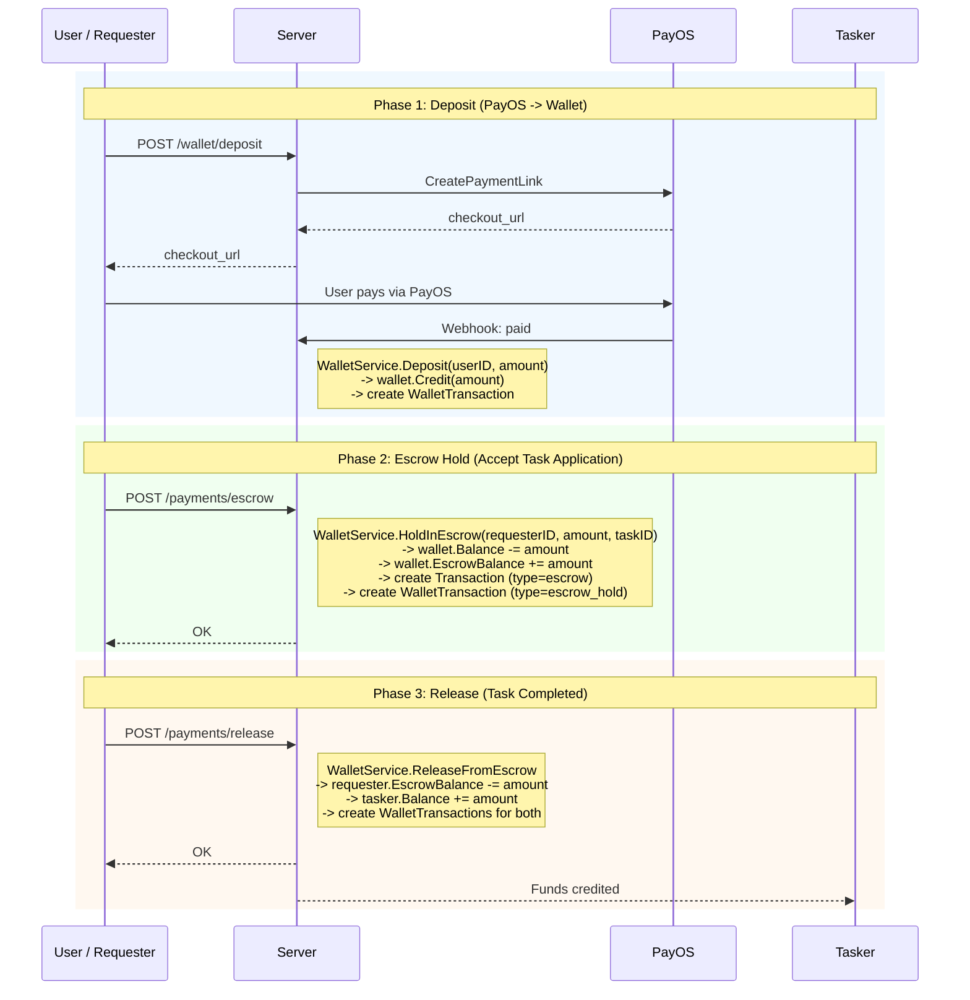
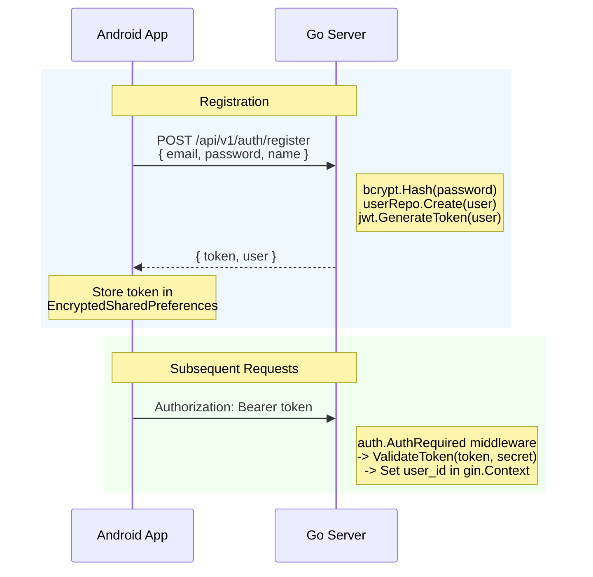
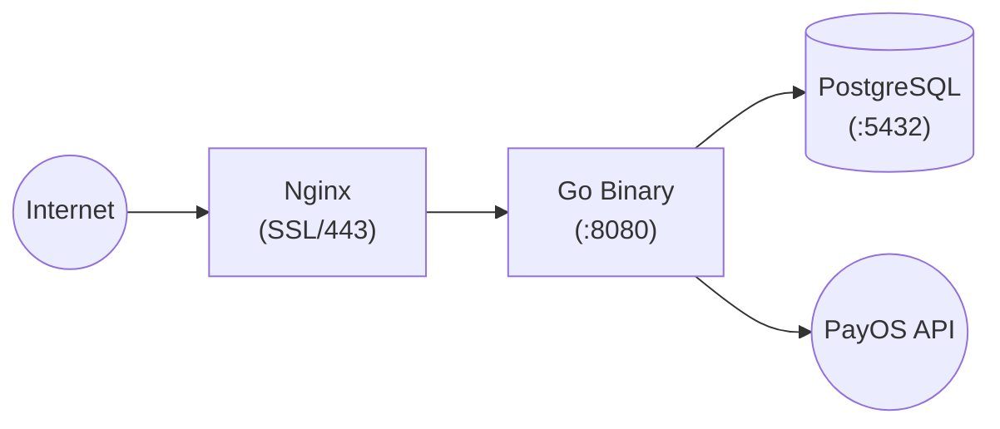
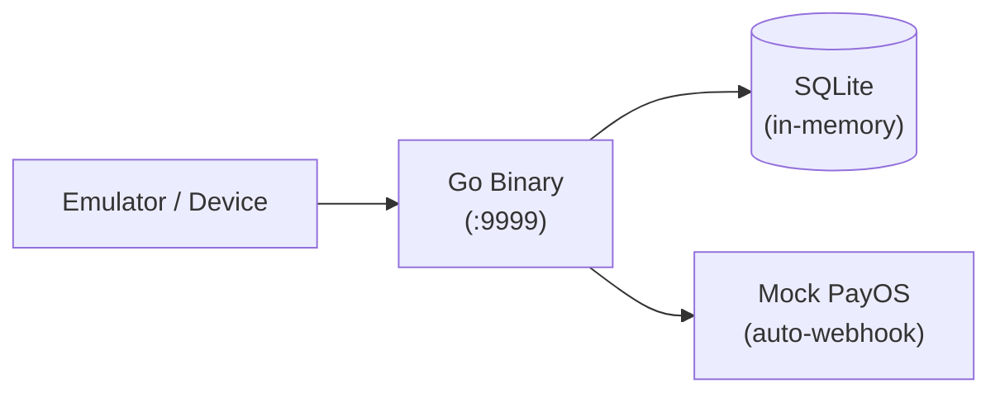

# Technical Architecture - Viecz

**Version:** 2.0
**Last Updated:** 2026-02-15

---

## Table of Contents

1. [Overview](#1-overview)
2. [System Architecture](#2-system-architecture)
3. [Technology Stack](#3-technology-stack)
4. [Go Backend Architecture](#4-go-backend-architecture)
5. [Android App Architecture](#5-android-app-architecture)
6. [Database Layer](#6-database-layer)
7. [WebSocket Architecture](#7-websocket-architecture)
8. [Payment & Wallet System](#8-payment--wallet-system)
9. [Authentication](#9-authentication)
10. [API Routes](#10-api-routes)
11. [Deployment](#11-deployment)

---

## 1. Overview

Viecz is a P2P marketplace connecting university students for small services. The system consists of:

- **Go backend** (Gin + GORM) serving REST and WebSocket APIs
- **Native Android app** (Kotlin + Jetpack Compose) with MVVM architecture
- **PostgreSQL** (production) / **SQLite** (test server) for persistence
- **PayOS** for payment processing (deposit via payment links, escrow via wallet)

---

## 2. System Architecture



### Request Flow



---

## 3. Technology Stack

### Backend

| Component        | Technology              | Version |
|------------------|-------------------------|---------|
| Language         | Go                      | 1.25    |
| HTTP Framework   | Gin                     | 1.11    |
| ORM              | GORM                    | 1.31    |
| Database (prod)  | PostgreSQL (via pgx)    | -       |
| Database (test)  | SQLite in-memory        | -       |
| Auth             | golang-jwt/jwt          | v5.3    |
| WebSocket        | Gorilla WebSocket       | 1.5     |
| Payments         | PayOS SDK               | v2.0    |
| Config           | godotenv                | 1.5     |
| Logging          | zerolog                 | 1.34    |
| Crypto           | golang.org/x/crypto     | -       |

### Android

| Component        | Technology              | Version   |
|------------------|-------------------------|-----------|
| Language         | Kotlin                  | 2.0       |
| UI Framework     | Jetpack Compose (M3)    | BOM 2024.12 |
| Navigation       | Navigation Compose      | 2.8       |
| DI               | Hilt                    | 2.52      |
| HTTP Client      | Retrofit + OkHttp       | 2.11 / 4.12 |
| JSON             | Moshi                   | 1.15      |
| Local DB         | Room                    | 2.6       |
| State            | ViewModel + StateFlow   | 2.8       |
| WebSocket        | OkHttp WebSocket        | 4.12      |
| Token Storage    | EncryptedSharedPrefs    | 1.0       |

---

## 4. Go Backend Architecture

### Package Structure

```
server/
├── cmd/
│   ├── server/main.go           # Production entrypoint (PostgreSQL)
│   └── testserver/main.go       # Test server entrypoint (SQLite in-memory, mock PayOS)
│
├── internal/
│   ├── auth/
│   │   ├── auth.go              # AuthService (register, login, bcrypt)
│   │   ├── jwt.go               # JWT token generation & validation
│   │   └── middleware.go         # AuthRequired, OptionalAuth gin middlewares
│   │
│   ├── config/
│   │   └── config.go            # Env-based config (DB, JWT, PayOS, fees)
│   │
│   ├── database/
│   │   ├── database.go          # Option pattern for DB config
│   │   ├── gorm.go              # NewGORM (PostgreSQL), AutoMigrate
│   │   ├── migrate.go           # golang-migrate (file-based migrations)
│   │   └── seed.go              # Seed categories + test users
│   │
│   ├── handlers/                # HTTP handlers (parse request → call service → respond)
│   │   ├── auth.go              # Register, Login, RefreshToken
│   │   ├── users.go             # GetProfile, GetMyProfile, UpdateProfile, BecomeTasker
│   │   ├── tasks.go             # CRUD + Apply, Accept, Complete
│   │   ├── categories.go        # GetCategories
│   │   ├── notification.go      # CRUD notifications, mark read, unread count
│   │   ├── payment.go           # CreateEscrowPayment, ReleasePayment, RefundPayment
│   │   ├── wallet.go            # GetWallet, Deposit, GetTransactionHistory
│   │   ├── webhook.go           # PayOS webhook handler
│   │   ├── return.go            # PayOS return URL handler
│   │   ├── websocket.go         # WebSocket upgrade + message handler
│   │   └── *_test.go            # Handler tests
│   │
│   ├── services/                # Business logic
│   │   ├── user.go              # UserService
│   │   ├── task.go              # TaskService (create, list, apply, accept, complete)
│   │   ├── notification.go      # NotificationService (create + WebSocket delivery)
│   │   ├── wallet.go            # WalletService (deposit, escrow, release, refund)
│   │   ├── payment.go           # PaymentService (orchestrates transactions + wallet)
│   │   ├── payos.go             # PayOSService (PayOSServicer interface + SDK wrapper)
│   │   ├── message.go           # MessageService (conversations + messages + WS broadcast)
│   │   └── *_test.go            # Service tests
│   │
│   ├── repository/              # Data access (interface + GORM implementation)
│   │   ├── user.go              # UserRepository interface
│   │   ├── user_gorm.go         # UserGormRepository (GORM implementation)
│   │   ├── task.go              # TaskRepository interface
│   │   ├── task_gorm.go         # TaskGormRepository
│   │   ├── task_application.go  # TaskApplicationRepository interface
│   │   ├── task_application_gorm.go
│   │   ├── category.go          # CategoryRepository interface
│   │   ├── category_gorm.go
│   │   ├── transaction.go       # TransactionRepository interface
│   │   ├── transaction_gorm.go
│   │   ├── wallet.go            # WalletRepository interface
│   │   ├── wallet_gorm.go
│   │   ├── wallet_transaction.go
│   │   ├── wallet_transaction_gorm.go
│   │   ├── conversation.go      # ConversationRepository interface
│   │   ├── conversation_gorm.go
│   │   ├── message.go           # MessageRepository interface
│   │   ├── message_gorm.go
│   │   ├── notification.go      # NotificationRepository interface
│   │   ├── notification_gorm.go
│   │   └── *_gorm_test.go       # Repository tests (SQLite in-memory)
│   │
│   ├── models/                  # GORM models (struct + Validate + BeforeCreate hooks)
│   │   ├── user.go
│   │   ├── task.go
│   │   ├── task_application.go
│   │   ├── category.go
│   │   ├── transaction.go
│   │   ├── wallet.go
│   │   ├── wallet_transaction.go
│   │   ├── conversation.go
│   │   ├── message.go           # Also defines WebSocketMessage and FlexTime
│   │   ├── notification.go      # Notification model + NotificationType enum
│   │   └── payment.go
│   │
│   ├── middleware/
│   │   └── cors.go              # CORS middleware for Gin
│   │
│   ├── websocket/
│   │   ├── hub.go               # Hub (register/unregister clients, broadcast to conversations)
│   │   └── client.go            # Client (readPump/writePump, Gorilla WebSocket)
│   │
│   ├── logger/
│   │   └── logger.go            # Zerolog setup
│   │
│   └── testutil/                # Test helpers
│       ├── assertions.go
│       ├── fixtures.go
│       ├── gorm_mock.go
│       └── mocks.go
│
├── migrations/                  # SQL migration files (golang-migrate)
├── static/                      # .well-known, privacy-policy.html
├── go.mod
└── go.sum
```

### Key Patterns

**Repository Interface Pattern**: Every data access concern is defined as an interface in `repository/<entity>.go`, with its GORM implementation in `repository/<entity>_gorm.go`. This enables testing with mock implementations.

```go
// repository/user.go — Interface
type UserRepository interface {
    Create(ctx context.Context, user *models.User) error
    GetByID(ctx context.Context, id int64) (*models.User, error)
    GetByEmail(ctx context.Context, email string) (*models.User, error)
    // ...
}

// repository/user_gorm.go — GORM Implementation
type userGormRepository struct { db *gorm.DB }
func NewUserGormRepository(db *gorm.DB) UserRepository { ... }
```

**Service Layer**: Services encapsulate business logic and depend on repository interfaces, not concrete implementations. Services are injected into handlers.

**Model Validation Hooks**: GORM models implement `BeforeCreate` and `BeforeUpdate` hooks that call `Validate()`, enforcing data integrity at the ORM level.

**Dependency Wiring** (in `cmd/server/main.go`):
```
Config → Database → Repositories → Services → Handlers → Gin Router
```

**Service Dependencies:**
- `TaskService` depends on `TaskRepository`, `TaskApplicationRepository`, `CategoryRepository`, `UserRepository`, `WalletService`, and `NotificationService`
- `PaymentService` depends on `TransactionRepository`, `TaskRepository`, `TaskApplicationRepository`, `WalletService`, and `NotificationService`
- `NotificationService` depends on `NotificationRepository` and `WebSocket Hub`
- `WalletService` depends on `WalletRepository`, `WalletTransactionRepository`, and `*gorm.DB`

---

## 5. Android App Architecture

### Package Structure

```
android/app/src/main/java/com/viecz/vieczandroid/
├── VieczApplication.kt              # @HiltAndroidApp entry point
├── MainActivity.kt                  # Single Activity (Compose host)
│
├── data/
│   ├── api/                         # Retrofit API interfaces
│   │   ├── AuthApi.kt               # POST /auth/register, /auth/login, /auth/refresh
│   │   ├── TaskApi.kt               # CRUD + apply/accept/complete
│   │   ├── CategoryApi.kt           # GET /categories
│   │   ├── UserApi.kt               # GET/PUT /users/me, /become-tasker
│   │   ├── WalletApi.kt             # GET /wallet, POST /wallet/deposit
│   │   ├── PaymentApi.kt            # Escrow/release/refund
│   │   ├── MessageApi.kt            # Conversations + messages
│   │   ├── NotificationApi.kt       # Notifications CRUD + mark read
│   │   ├── AuthInterceptor.kt       # OkHttp interceptor (injects Bearer token)
│   │   └── ErrorResponse.kt         # Error parsing
│   │
│   ├── auth/
│   │   └── AuthEventManager.kt      # Emits auth events (token expired → force logout)
│   │
│   ├── local/
│   │   ├── TokenManager.kt          # EncryptedSharedPreferences for JWT storage
│   │   ├── database/
│   │   │   ├── AppDatabase.kt       # Room database (tasks, categories, notifications)
│   │   │   └── Converters.kt        # Room type converters
│   │   ├── dao/
│   │   │   ├── TaskDao.kt
│   │   │   ├── CategoryDao.kt
│   │   │   └── NotificationDao.kt
│   │   └── entities/
│   │       ├── TaskEntity.kt
│   │       ├── CategoryEntity.kt
│   │       └── NotificationEntity.kt
│   │
│   ├── models/                      # Data classes (API response/request DTOs)
│   │   ├── AuthModels.kt
│   │   ├── Task.kt
│   │   ├── TaskApplication.kt
│   │   ├── Category.kt
│   │   ├── User.kt
│   │   ├── Wallet.kt
│   │   ├── Transaction.kt
│   │   ├── Conversation.kt
│   │   ├── Message.kt
│   │   ├── PaymentRequest.kt
│   │   ├── PaymentResponse.kt
│   │   └── Notification.kt          # ServerNotification + response DTOs
│   │
│   ├── repository/                  # Repository classes (API + local cache)
│   │   ├── AuthRepository.kt       # AuthApi + TokenManager
│   │   ├── TaskRepository.kt       # TaskApi + TaskDao (offline cache)
│   │   ├── CategoryRepository.kt   # CategoryApi + CategoryDao
│   │   ├── UserRepository.kt       # UserApi
│   │   ├── WalletRepository.kt     # WalletApi
│   │   ├── PaymentRepository.kt    # PaymentApi
│   │   ├── MessageRepository.kt    # MessageApi
│   │   └── NotificationRepository.kt # NotificationApi + NotificationDao (network-first, local cache)
│   │
│   └── websocket/
│       └── WebSocketClient.kt      # OkHttp WebSocket (connect, join, send, typing, read)
│
├── di/                              # Hilt DI modules
│   ├── NetworkModule.kt             # OkHttp, Retrofit, Moshi, API interfaces
│   └── DataModule.kt               # TokenManager, Room DB, DAOs, Repositories
│
├── ui/
│   ├── navigation/
│   │   └── Navigation.kt           # NavHost + all route definitions
│   │
│   ├── screens/                     # Composable screens
│   │   ├── SplashScreen.kt
│   │   ├── LoginScreen.kt
│   │   ├── RegisterScreen.kt
│   │   ├── MainScreen.kt           # Bottom navigation shell (Home, Chat, Profile tabs)
│   │   ├── HomeScreen.kt           # Task list feed
│   │   ├── TaskDetailScreen.kt     # Task details + apply/accept/complete actions
│   │   ├── CreateTaskScreen.kt
│   │   ├── ApplyTaskScreen.kt
│   │   ├── MyJobsScreen.kt         # Posted / Applied / Completed jobs
│   │   ├── ProfileScreen.kt
│   │   ├── WalletScreen.kt         # Balance, deposit, transaction history
│   │   ├── ChatScreen.kt           # Real-time chat (WebSocket)
│   │   ├── ConversationListScreen.kt
│   │   ├── NotificationScreen.kt
│   │   └── PaymentScreen.kt
│   │
│   ├── viewmodels/                  # ViewModels (Hilt-injected, expose StateFlow)
│   │   ├── AuthViewModel.kt
│   │   ├── TaskListViewModel.kt
│   │   ├── TaskDetailViewModel.kt
│   │   ├── CreateTaskViewModel.kt
│   │   ├── CategoryViewModel.kt
│   │   ├── ChatViewModel.kt
│   │   ├── ConversationListViewModel.kt
│   │   ├── WalletViewModel.kt
│   │   ├── PaymentViewModel.kt
│   │   └── NotificationViewModel.kt
│   │
│   ├── components/
│   │   └── TaskCard.kt              # Reusable task card component
│   │
│   └── theme/
│       ├── Color.kt
│       ├── Theme.kt
│       └── Type.kt
│
└── utils/
    ├── FormatUtils.kt               # Currency/date formatting
    ├── HttpErrorParser.kt           # Parse error responses
    └── ValidationUtils.kt           # Input validation
```

### MVVM Data Flow



### Hilt Dependency Graph

```
NetworkModule (@Singleton)
├── OkHttpClient (AuthInterceptor + LoggingInterceptor)
├── Retrofit (Moshi converter)
├── AuthApi, TaskApi, CategoryApi, UserApi, WalletApi, PaymentApi, MessageApi, NotificationApi

DataModule (@Singleton)
├── TokenManager (EncryptedSharedPreferences)
├── AppDatabase (Room)
├── TaskDao, CategoryDao, NotificationDao
├── AuthRepository, TaskRepository, CategoryRepository
├── UserRepository, WalletRepository, PaymentRepository, NotificationRepository(NotificationApi + NotificationDao)
```

### Navigation Routes

| Route                    | Screen                   | Auth Required |
|--------------------------|--------------------------|---------------|
| `splash`                 | SplashScreen             | No            |
| `login`                  | LoginScreen              | No            |
| `register`               | RegisterScreen           | No            |
| `main`                   | MainScreen (bottom tabs) | Yes           |
| `task_detail/{taskId}`   | TaskDetailScreen         | Yes           |
| `create_task`            | CreateTaskScreen         | Yes           |
| `apply_task/{taskId}/{price}` | ApplyTaskScreen     | Yes           |
| `profile`                | ProfileScreen            | Yes           |
| `wallet`                 | WalletScreen             | Yes           |
| `chat/{conversationId}`  | ChatScreen               | Yes           |
| `notifications`          | NotificationScreen       | Yes           |
| `my_jobs/{mode}`         | MyJobsScreen             | Yes           |

### Product Flavors

| Flavor | API Base URL                        | App Name    | Application ID Suffix |
|--------|-------------------------------------|-------------|----------------------|
| `dev`  | `http://10.0.2.2:9999/api/v1/`      | Viecz Dev   | `.dev`               |
| `prod` | Production server URL               | Viecz       | (none)               |

---

## 6. Database Layer

### GORM Models (AutoMigrate)

The following models are auto-migrated on server startup:

```
User, Category, Task, TaskApplication, Transaction,
Wallet, WalletTransaction, Conversation, Message, Notification
```

### Entity Relationship Diagram



### Production vs Test Server Database

| Aspect          | Production (`cmd/server`)     | Test (`cmd/testserver`)          |
|-----------------|-------------------------------|----------------------------------|
| Database        | PostgreSQL (via GORM driver)  | SQLite in-memory                 |
| Connection      | `database.NewGORM()` + options| `gorm.Open(sqlite.Open(...))`    |
| Migrations      | AutoMigrate + golang-migrate  | AutoMigrate only                 |
| Seed Data       | Categories + test user        | Categories + test user           |
| PayOS           | Real PayOS SDK                | Mock (auto-fires webhook)        |
| Port            | Configurable (default 8080)   | 9999 (hardcoded)                 |
| JWT Secret      | From env var                  | `e2e-test-secret-key`            |

### Android Local Database (Room)

Room is used for offline caching on the Android side:

| Entity            | Purpose                           |
|-------------------|-----------------------------------|
| `TaskEntity`      | Cache task list for offline view  |
| `CategoryEntity`  | Cache categories                  |
| `NotificationEntity` | Server notification cache (network-first) |

---

## 7. WebSocket Architecture

### Server-Side (Gorilla WebSocket)



### Connection Flow



### WebSocket Message Types

| Type      | Direction      | Description                          |
|-----------|----------------|--------------------------------------|
| `join`    | Client → Server | Join a conversation room             |
| `leave`   | Client → Server | Leave a conversation room            |
| `message` | Bidirectional  | Chat message                         |
| `typing`  | Client → Server | Typing indicator                     |
| `read`    | Client → Server | Mark conversation as read            |
| `notification` | Server → Client | Real-time notification push     |
| `error`   | Server → Client | Error response                       |

### Client-Side (OkHttp WebSocket)

The Android `WebSocketClient` is a `@Singleton` injected via Hilt. It:
- Connects with `ws://<base_url>/ws?token=<jwt>`
- Exposes `connectionState: StateFlow<WebSocketState>`
- Exposes `messages: Channel<WebSocketMessage>` for incoming messages
- Provides methods: `connect()`, `joinConversation()`, `sendChatMessage()`, `sendTypingIndicator()`, `markAsRead()`, `disconnect()`

---

## 8. Payment & Wallet System

### Wallet-Based Escrow Flow



### Wallet Transaction Types

| Type               | Amount Sign | Description                        |
|--------------------|-------------|------------------------------------|
| `deposit`          | +           | PayOS deposit credited to wallet   |
| `withdrawal`       | -           | Withdrawn from wallet              |
| `escrow_hold`      | -           | Balance → escrow (task accepted)   |
| `escrow_release`   | -           | Escrow → payee (task completed)    |
| `escrow_refund`    | +           | Escrow → balance (task cancelled)  |
| `payment_received` | +           | Received from escrow release       |
| `platform_fee`     | -           | Platform fee deduction             |

### Max Wallet Balance

Configurable via `MAX_WALLET_BALANCE` env var (default: 200,000 VND). Deposits that would exceed this limit are rejected before creating the PayOS payment link.

---

## 9. Authentication

### Flow



### JWT Claims

```go
type Claims struct {
    UserID   int64  `json:"user_id"`
    Email    string `json:"email"`
    Name     string `json:"name"`
    IsTasker bool   `json:"is_tasker"`
    jwt.RegisteredClaims
}
```

### Middleware

- `AuthRequired(jwtSecret)` -- Rejects requests without valid Bearer token. Sets `user_id`, `email`, `name`, `is_tasker` in gin context.
- `OptionalAuth(jwtSecret)` -- Extracts user info if token present, but allows unauthenticated access.
- `auth.GetUserID(c *gin.Context)` -- Helper to extract user ID from context.

### Android Side

- `AuthInterceptor` (OkHttp interceptor) reads token from `TokenManager` and adds `Authorization: Bearer <token>` to every request.
- `AuthEventManager` emits events when token expires (401 response), triggering force logout in the UI.

---

## 10. API Routes

All routes are prefixed with `/api/v1/`.

### Public Routes

| Method | Path                      | Handler                    |
|--------|---------------------------|----------------------------|
| GET    | `/health`                 | Health check               |
| POST   | `/auth/register`          | Register new user          |
| POST   | `/auth/login`             | Login (email + password)   |
| POST   | `/auth/refresh`           | Refresh JWT token          |
| GET    | `/categories`             | List all categories        |
| GET    | `/users/:id`              | Get public user profile    |
| POST   | `/payment/webhook`        | PayOS webhook callback     |
| POST   | `/payment/confirm-webhook`| Confirm webhook URL        |

### Protected Routes (require `Authorization: Bearer <token>`)

| Method | Path                           | Handler                       |
|--------|--------------------------------|-------------------------------|
| GET    | `/users/me`                    | Get current user profile      |
| PUT    | `/users/me`                    | Update profile                |
| POST   | `/users/become-tasker`         | Register as tasker            |
| POST   | `/tasks`                       | Create task                   |
| GET    | `/tasks`                       | List tasks (with filters)     |
| GET    | `/tasks/:id`                   | Get task detail               |
| PUT    | `/tasks/:id`                   | Update task                   |
| DELETE | `/tasks/:id`                   | Delete task                   |
| POST   | `/tasks/:id/applications`      | Apply for task                |
| GET    | `/tasks/:id/applications`      | Get task applications         |
| POST   | `/tasks/:id/complete`          | Mark task completed           |
| POST   | `/applications/:id/accept`     | Accept application            |
| GET    | `/wallet`                      | Get wallet balance            |
| POST   | `/wallet/deposit`              | Create deposit (PayOS link)   |
| GET    | `/wallet/transactions`         | Wallet transaction history    |
| POST   | `/payments/escrow`             | Create escrow payment         |
| POST   | `/payments/release`            | Release escrow to tasker      |
| POST   | `/payments/refund`             | Refund escrow to requester    |
| GET    | `/notifications`               | List notifications            |
| GET    | `/notifications/unread-count`  | Get unread count              |
| POST   | `/notifications/:id/read`      | Mark notification as read     |
| POST   | `/notifications/read-all`      | Mark all as read              |
| DELETE | `/notifications/:id`           | Delete notification           |
| GET    | `/conversations`               | List user's conversations     |
| POST   | `/conversations`               | Create conversation           |
| GET    | `/conversations/:id/messages`  | Get conversation messages     |
| GET    | `/ws?token=<jwt>`              | WebSocket upgrade             |

---

## 11. Deployment

### Server Infrastructure

Production runs on a dedicated bare metal server. Infrastructure details (IP, hostname, provider specs) are maintained separately and not included in public documentation.

### Production Stack



### Test Server Stack



---

*This is a living document. Update as the architecture evolves.*
