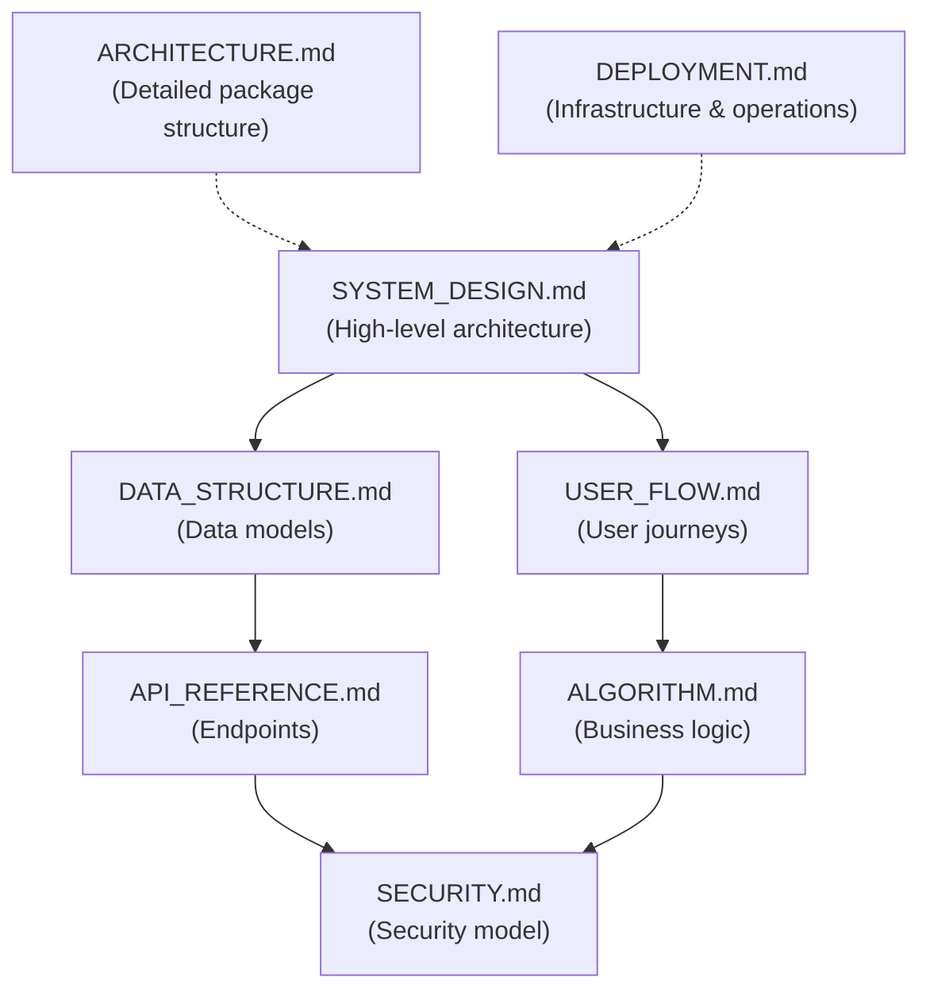

# Technical Documentation

**Project:** Viecz - Dịch Vụ Nhỏ Cho Sinh Viên
**Last Updated:** 2026-02-21
**Stack:** Go (Gin) backend + Native Kotlin/Jetpack Compose Android app + Angular 21 web client

---

## Documentation Index

| Document | Description | Key Topics |
|----------|-------------|------------|
| **[SYSTEM_DESIGN.md](./SYSTEM_DESIGN.md)** | System architecture & design | High-level architecture, tech stack, patterns |
| **[ARCHITECTURE.md](./ARCHITECTURE.md)** | Package structure & patterns | Go backend layers, Android MVVM, ER diagram |
| **[DATA_STRUCTURE.md](./DATA_STRUCTURE.md)** | Data models | 10 GORM models, schemas, relationships |
| **[API_REFERENCE.md](./API_REFERENCE.md)** | API endpoint reference | 39 REST endpoints + WebSocket, request/response examples |
| **[USER_FLOW.md](./USER_FLOW.md)** | User journey documentation | Auth, task, payment, chat flows |
| **[ALGORITHM.md](./ALGORITHM.md)** | Core algorithms & complexity | JWT, escrow, WebSocket routing, wallet management |
| **[SECURITY.md](./SECURITY.md)** | Security measures | JWT auth, bcrypt, CORS, PayOS webhook verification |
| **[DEPLOYMENT.md](./DEPLOYMENT.md)** | Deployment & infrastructure | Docker Compose, Cloudflare tunnel, Android build flavors |
| **[FIREBASE_DISTRIBUTION.md](./FIREBASE_DISTRIBUTION.md)** | App distribution | Firebase App Distribution workflow, tester management |
| **[SECURITY_AUDIT_2026_02_20.md](./SECURITY_AUDIT_2026_02_20.md)** | Security audit | 6 CRITICAL, 7 HIGH, 14 MEDIUM, 10 LOW findings |
| **[ASCII_ART_SVG.md](./ASCII_ART_SVG.md)** | Image to ASCII art SVG | image2ascii pipeline, colored SVG generation, canvas glitch effects |
| **[DESIGN_SYSTEM.md](./DESIGN_SYSTEM.md)** | nhannht-metro-meow design system | Tokens, components, layout patterns, Tailwind 4 mapping, Storybook catalog |
| **[WEB_MIGRATION.md](./WEB_MIGRATION.md)** | Web client migration guide | Angular Material → Tailwind 4 + Storybook, phase-by-phase plan |
| **[UI_COMPONENT_CATALOG.md](./UI_COMPONENT_CATALOG.md)** | UI component API reference | 28 shared components + 1 service, inputs/outputs, usage examples |
| **[UI_PATTERNS.md](./UI_PATTERNS.md)** | Page-level UI patterns | Loading/empty/error states, forms, grids, navigation, feedback |
| **[UI_RESPONSIVE.md](./UI_RESPONSIVE.md)** | Responsive design patterns | Breakpoints, grid strategies, container widths, mobile behavior |
| **[UI_ACCESSIBILITY.md](./UI_ACCESSIBILITY.md)** | Accessibility audit | ARIA per component, known gaps, keyboard nav, testing tools |
| **[UI_PLATFORM_PARITY.md](./UI_PLATFORM_PARITY.md)** | Android vs Web comparison | Screen-by-screen parity, navigation, design language |
| **[UI_ANIMATION.md](./UI_ANIMATION.md)** | Animation & transitions | Duration scale, hover effects, loading animations, guidelines |

---

## Quick Start

### For New Developers

Read in this order:
1. **[SYSTEM_DESIGN.md](./SYSTEM_DESIGN.md)** - Big picture
2. **[ARCHITECTURE.md](./ARCHITECTURE.md)** - Package structure
3. **[DATA_STRUCTURE.md](./DATA_STRUCTURE.md)** - Data models
4. **[API_REFERENCE.md](./API_REFERENCE.md)** - Endpoints

### For Backend Developers

1. **[DATA_STRUCTURE.md](./DATA_STRUCTURE.md)** - GORM models and schemas
2. **[API_REFERENCE.md](./API_REFERENCE.md)** - Endpoint specifications
3. **[ALGORITHM.md](./ALGORITHM.md)** - Business logic (escrow, wallet)
4. **[SECURITY.md](./SECURITY.md)** - JWT, middleware, PayOS verification

### For Android Developers

1. **[USER_FLOW.md](./USER_FLOW.md)** - User journeys and screen flows
2. **[API_REFERENCE.md](./API_REFERENCE.md)** - Backend API contracts
3. **[DATA_STRUCTURE.md](./DATA_STRUCTURE.md)** - Models
4. **[ARCHITECTURE.md](./ARCHITECTURE.md)** - Android MVVM architecture

### For Web Developers

1. **[DESIGN_SYSTEM.md](./DESIGN_SYSTEM.md)** - nhannht-metro-meow design tokens, components, patterns
2. **[UI_COMPONENT_CATALOG.md](./UI_COMPONENT_CATALOG.md)** - Full API reference for all 28 shared components
3. **[UI_PATTERNS.md](./UI_PATTERNS.md)** - Page-level patterns (states, forms, grids, navigation)
4. **[UI_RESPONSIVE.md](./UI_RESPONSIVE.md)** - Breakpoints, container widths, mobile behavior
5. **[UI_ACCESSIBILITY.md](./UI_ACCESSIBILITY.md)** - ARIA audit, keyboard nav, known gaps
6. **[UI_ANIMATION.md](./UI_ANIMATION.md)** - Duration scale, hover effects, loading animations
7. **[UI_PLATFORM_PARITY.md](./UI_PLATFORM_PARITY.md)** - Android vs Web screen comparison
8. **[WEB_MIGRATION.md](./WEB_MIGRATION.md)** - Migration guide (Material → Tailwind 4 + Storybook)
9. **[ARCHITECTURE.md](./ARCHITECTURE.md)** - Web client architecture (Section 6)
10. **[API_REFERENCE.md](./API_REFERENCE.md)** - Backend API contracts (shared with Android)
11. **[SECURITY.md](./SECURITY.md)** - Web token storage, auth interceptor (Section 10)
12. **[DEPLOYMENT.md](./DEPLOYMENT.md)** - Web build & deployment (Section 7b)

### For DevOps

1. **[DEPLOYMENT.md](./DEPLOYMENT.md)** - Docker, Cloudflare tunnel, env config
2. **[FIREBASE_DISTRIBUTION.md](./FIREBASE_DISTRIBUTION.md)** - APK distribution to testers
3. **[SECURITY.md](./SECURITY.md)** - Security checklist
4. **[SYSTEM_DESIGN.md](./SYSTEM_DESIGN.md)** - Infrastructure overview

---

## Document Relationships

---

## Navigate by Feature

**Task Management:**
- DATA_STRUCTURE.md → Task, TaskApplication models
- API_REFERENCE.md → Task endpoints
- USER_FLOW.md → Requester & Tasker flows
- ALGORITHM.md → Task matching

**Payment System (PayOS):**
- DATA_STRUCTURE.md → Transaction, Wallet models
- API_REFERENCE.md → Payment & Wallet endpoints
- ALGORITHM.md → Escrow & fee calculation
- SECURITY.md → PayOS webhook verification

**Authentication (JWT):**
- DATA_STRUCTURE.md → User model
- API_REFERENCE.md → Auth endpoints
- SECURITY.md → JWT implementation
- ALGORITHM.md → Token lifecycle

**Real-time Chat (WebSocket):**
- DATA_STRUCTURE.md → Conversation, Message models
- API_REFERENCE.md → WebSocket endpoint
- ALGORITHM.md → WebSocket hub routing
- SECURITY.md → WebSocket auth

---

## Glossary

| Term | Definition |
|------|-----------|
| **Requester** | User who posts tasks |
| **Tasker** | User who performs tasks (must register) |
| **Escrow** | Platform holds payment until task completion |
| **PayOS** | Payment gateway for VND deposits |
| **JWT** | JSON Web Token for API authentication |
| **WebSocket** | Real-time bidirectional messaging protocol |
| **GORM** | Go ORM used for database access |
| **Gin** | Go HTTP web framework |

---

**Last Updated:** 2026-02-21
**Maintained By:** Development Team
