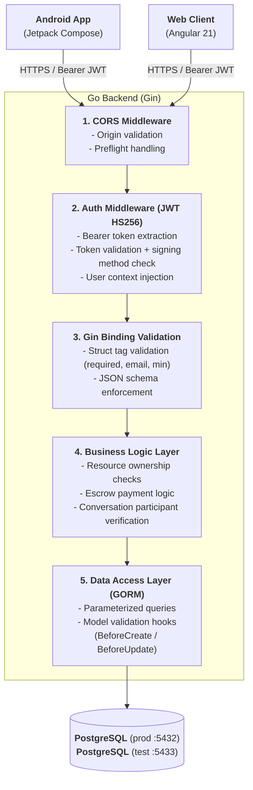

# Security Documentation

**Project:** Viecz (Mini Services for Students)
**Last Updated:** 2026-02-21
**Status:** Development

---

## Table of Contents

1. [Overview](#1-overview)
2. [Authentication](#2-authentication)
3. [Authorization](#3-authorization)
4. [Password Hashing](#4-password-hashing)
5. [Input Validation](#5-input-validation)
6. [CORS Configuration](#6-cors-configuration)
7. [Payment Security](#7-payment-security)
8. [WebSocket Security](#8-websocket-security)
9. [Token Storage (Android)](#9-token-storage-android)
10. [Token Storage (Web Client)](#10-token-storage-web-client)
11. [File Upload Security](#11-file-upload-security)
12. [Known Limitations](#12-known-limitations)

---

## 1. Overview

### 1.1 Security Architecture



### 1.2 Technology Stack

| Layer | Technology |
|-------|-----------|
| Backend framework | Go + Gin |
| Authentication | Email/password + Google OAuth (OIDC) + JWT (golang-jwt/jwt v5) |
| Password hashing | bcrypt (golang.org/x/crypto/bcrypt) |
| ORM | GORM (PostgreSQL for both prod and test) |
| Payment gateway | PayOS (payos-lib-golang v2) |
| WebSocket | Gorilla WebSocket |
| Android HTTP | OkHttp + Retrofit |
| Android token storage | EncryptedSharedPreferences (AES-256) |
| Web HTTP | Angular HttpClient + functional interceptors |
| Web token storage | localStorage (browser) |
| Web route protection | Angular functional guards (authGuard) |

---

## 2. Authentication

### 2.1 Auth Flow

The project supports two authentication methods:
1. **Email/password** -- Traditional registration and login with bcrypt-hashed passwords
2. **Google OAuth (OIDC)** -- Sign in with Google, using OpenID Connect ID token verification

**Endpoints:**
- `POST /api/v1/auth/register` -- Create account (email/password)
- `POST /api/v1/auth/login` -- Get access + refresh tokens (email/password)
- `POST /api/v1/auth/google` -- Sign in with Google ID token
- `POST /api/v1/auth/refresh` -- Exchange refresh token for new access token

**Source:** `server/internal/handlers/auth.go`, `server/internal/auth/auth.go`, `server/internal/auth/google_oauth.go`, `server/internal/services/turnstile.go`

### 2.1.1 Bot Prevention (Cloudflare Turnstile)

Registration is protected by Cloudflare Turnstile — an invisible CAPTCHA that runs a browser challenge without user interaction.

**Flow:**
1. Web client loads Turnstile script and renders invisible widget on register form
2. Turnstile issues a one-time token via callback
3. Client sends `turnstile_token` in the registration request body
4. Server POSTs `{secret, response, remoteip}` to `https://challenges.cloudflare.com/turnstile/v0/siteverify`
5. If `success: false` → reject with `400 bot verification failed`
6. If `success: true` → proceed to email validation and registration

**Graceful degradation:** If `TURNSTILE_SECRET_KEY` is not set, the `TurnstileService` is `nil` and validation is skipped entirely. This keeps the test server and E2E tests unaffected.

**Scope:** Web client only. Android is deferred (Turnstile has no native SDK).

**Source:** `server/internal/services/turnstile.go`, `web/src/app/auth/register.component.ts`

### 2.2 JWT Implementation

**Library:** `github.com/golang-jwt/jwt/v5`

#### Token Types

| Token Type | Lifetime | Claims | Use Case |
|------------|----------|--------|----------|
| Access Token | 30 minutes | `sub` (user ID), `email`, `name`, `is_tasker`, `exp`, `iat`, `nbf` | API authentication |
| Refresh Token | 7 days | `sub` (user ID), `email`, `exp`, `iat`, `nbf` | Token renewal |

Both tokens use **HS256** (HMAC-SHA256) signing.

#### Access Token Claims

```go
type Claims struct {
    UserID   int64  `json:"sub"`
    Email    string `json:"email"`
    Name     string `json:"name"`
    IsTasker bool   `json:"is_tasker"`
    jwt.RegisteredClaims // exp, iat, nbf
}
```

**Source:** `server/internal/auth/jwt.go`

#### Token Generation

```go
// Access token: 30 minutes
auth.GenerateAccessToken(user, jwtSecret, 30)

// Refresh token: 7 days
auth.GenerateRefreshToken(user, jwtSecret, 7)
```

Both `Register` and `Login` handlers return the same `TokenResponse`:

```json
{
  "access_token": "<jwt>",
  "refresh_token": "<jwt>",
  "user": { ... }
}
```

#### Token Validation

```go
func ValidateToken(tokenString string, secret string) (*Claims, error) {
    token, err := jwt.ParseWithClaims(tokenString, &Claims{}, func(token *jwt.Token) (interface{}, error) {
        // Verify signing method is HMAC (prevents algorithm confusion attacks)
        if _, ok := token.Method.(*jwt.SigningMethodHMAC); !ok {
            return nil, fmt.Errorf("unexpected signing method: %v", token.Header["alg"])
        }
        return []byte(secret), nil
    })
    // ...
}
```

The validation checks:
1. Signing method is HMAC (rejects RSA/none algorithm attacks)
2. Signature validity
3. Token expiration (`exp` claim)
4. Not-before time (`nbf` claim)

**Source:** `server/internal/auth/jwt.go:64-84`

#### Token Refresh

`POST /api/v1/auth/refresh` accepts a `refresh_token`, validates it, and returns a new access token. The refresh token itself is not rotated.

**Note:** The refresh handler reconstructs a `User` from the refresh token claims rather than fetching from the database. This means stale user data (e.g., changed `is_tasker` flag) persists in new access tokens until the user performs a full login.

**Source:** `server/internal/handlers/auth.go:132-170`

### 2.3 JWT Secret Configuration

| Environment | Secret | Source |
|-------------|--------|--------|
| Test server | `e2e-test-secret-key` | Hardcoded in `cmd/testserver/main.go` |
| All others | Must be set via `JWT_SECRET` env var | Enforced: config fails if default or empty value is used |

**Enforcement:** Server startup rejects the default secret (`your-secret-key-change-in-production`) and empty strings in **all** environments (not just production). This prevents accidental deployment with insecure defaults.

**Source:** `server/internal/config/config.go:92-95`

### 2.4 Google OAuth (OIDC)

#### Overview

Google sign-in uses OpenID Connect (OIDC) with server-side ID token verification. The Android client obtains a Google ID token via the Google Sign-In SDK and sends it to `POST /api/v1/auth/google`. The backend verifies the token against Google's OIDC provider before creating or authenticating the user.

**Libraries:**
- `github.com/coreos/go-oidc/v3/oidc` -- OIDC provider discovery and ID token verification
- `golang.org/x/oauth2` + `golang.org/x/oauth2/google` -- OAuth2 configuration

#### OIDC Provider Verification

The `GoogleOAuthService` initializes an OIDC provider from `https://accounts.google.com` and creates a verifier bound to the configured `GOOGLE_CLIENT_ID`:

```go
provider, err := oidc.NewProvider(context.Background(), "https://accounts.google.com")
verifier := provider.Verifier(&oidc.Config{
    ClientID: clientID,
})
```

The verifier checks:
1. **Token signature** -- RSA signature against Google's public keys (fetched from OIDC discovery endpoint)
2. **Audience (`aud`)** -- Must match the configured `GOOGLE_CLIENT_ID`
3. **Issuer (`iss`)** -- Must be `https://accounts.google.com`
4. **Expiration (`exp`)** -- Token must not be expired

**Source:** `server/internal/auth/google_oauth.go:28-49`

#### ID Token Claims Extraction

After signature verification, the following claims are extracted from the ID token:

| Claim | Type | Description |
|-------|------|-------------|
| `sub` | `string` | Google's unique user ID (stored as `GoogleID`) |
| `email` | `string` | User's Google email address |
| `email_verified` | `bool` | Whether Google has verified the email |
| `name` | `string` | User's display name |
| `picture` | `string` | URL to user's Google profile picture |

#### Email Verification Requirement

The backend **rejects** Google ID tokens where `email_verified` is `false`:

```go
if !claims.EmailVerified {
    return nil, fmt.Errorf("email not verified by Google")
}
```

This prevents authentication with unverified Google accounts and ensures email address ownership.

**Source:** `server/internal/auth/google_oauth.go:52-85`

#### Google User Creation Flow

`LoginWithGoogle` handles three scenarios:

1. **Returning Google user** (Google ID exists in DB) -- Logs in, updates name/avatar if changed
2. **Email conflict** (email exists with `AuthProvider == "email"`) -- Returns `409 Conflict` with `ErrEmailAlreadyUsedByEmail`. Users who registered via email/password cannot switch to Google sign-in for the same email
3. **New Google user** (no Google ID, no email match) -- Creates a new user with `AuthProvider = "google"`, `EmailVerified = true`, `PasswordHash = nil`

```go
// Conflict check
if existingUser.AuthProvider == "email" {
    return nil, ErrEmailAlreadyUsedByEmail
}
```

**Source:** `server/internal/auth/auth.go:104-158`

#### Login Guard for Google Users

The `Login` handler (email/password) rejects users who registered via Google:

```go
if user.AuthProvider != "email" || user.PasswordHash == nil {
    return nil, ErrInvalidCredentials
}
```

This prevents password-based login attempts against Google-authenticated accounts (which have no password hash).

**Source:** `server/internal/auth/auth.go:91-94`

#### Environment Variables

| Variable | Required | Description |
|----------|----------|-------------|
| `GOOGLE_CLIENT_ID` | Yes (for Google auth) | Google OAuth client ID from Google Cloud Console |
| `GOOGLE_CLIENT_SECRET` | Yes (for Google auth) | Google OAuth client secret |

Both are read from environment variables without defaults. If not set, Google OAuth is unavailable.

**Source:** `server/internal/config/config.go:30-31, 65-66`

#### Endpoint: `POST /api/v1/auth/google`

**Request:**
```json
{
  "id_token": "<Google ID token from Android client>"
}
```

**Validation:** `id_token` field is `required` (Gin binding tag).

**Responses:**

| Status | Condition |
|--------|-----------|
| `200 OK` | Successful authentication (returns `TokenResponse` with access/refresh tokens) |
| `400 Bad Request` | Missing `id_token` |
| `401 Unauthorized` | Invalid/expired Google ID token |
| `409 Conflict` | Email already registered with email/password authentication |
| `500 Internal Server Error` | User creation or token generation failure |

**Source:** `server/internal/handlers/auth.go:139-188`

### 2.5 User Model OAuth Fields

The `User` model includes three fields for OAuth support:

| Field | Type | GORM Tags | Security Notes |
|-------|------|-----------|----------------|
| `AuthProvider` | `string` | `size:20;not null;default:'email'` | Controls which authentication method is valid. Must be `"email"` or `"google"`. Validated in `Validate()`. |
| `GoogleID` | `*string` | `size:255;unique` / `json:"-"` | Google's `sub` claim. Has `unique` DB constraint to prevent duplicate Google accounts. Excluded from JSON responses via `json:"-"`. Required when `AuthProvider == "google"`. |
| `EmailVerified` | `bool` | `default:false` | Set to `true` for Google users (Google pre-verifies emails). Used to distinguish verified vs unverified accounts. |

**Validation rules** (enforced in `User.Validate()`):
- `AuthProvider` must be `"email"` or `"google"`
- `PasswordHash` is required when `AuthProvider == "email"`, nullable for Google users
- `GoogleID` is required when `AuthProvider == "google"`

**Source:** `server/internal/models/user.go:25-27, 60-73`

---

## 3. Authorization

### 3.1 Auth Middleware

**`AuthRequired`** -- Gin middleware that enforces JWT authentication.

```go
func AuthRequired(jwtSecret string) gin.HandlerFunc
```

Steps:
1. Extract `Authorization: Bearer <token>` header
2. Validate JWT token
3. Inject `user_id`, `email`, `name`, `is_tasker` into Gin context
4. Abort with 401 on failure

**`OptionalAuth`** -- Same extraction logic but does not abort if token is missing. Used for endpoints that behave differently for authenticated vs anonymous users.

**Source:** `server/internal/auth/middleware.go`

### 3.2 Protected Routes

The following route groups require `AuthRequired`:

| Route Group | Middleware |
|-------------|-----------|
| `GET/PUT /api/v1/users/me`, `POST /api/v1/users/become-tasker` | AuthRequired |
| `/api/v1/tasks/*` | AuthRequired |
| `/api/v1/applications/*` | AuthRequired |
| `/api/v1/wallet/*` | AuthRequired |
| `/api/v1/payments/*` | AuthRequired |
| `/api/v1/conversations/*` | AuthRequired |
| `/api/v1/notifications/*` | AuthRequired |

Public routes (no auth): `/api/v1/auth/*`, `/api/v1/health`, `/api/v1/categories`, `GET /api/v1/users/:id`, `/api/v1/payment/webhook`.

**Source:** `server/cmd/server/main.go:132-224`

### 3.3 Resource Ownership

Authorization checks are enforced at the service/handler level:

- **Tasks:** Only the requester can update/delete their own tasks
- **Escrow payment:** Only the task requester can create escrow (`task.RequesterID != payerID`)
- **Release payment:** Only the requester can release (`task.RequesterID != requesterID`)
- **Refund payment:** Only the requester can refund
- **Conversations:** Only poster or tasker can send/read messages (`conversation.PosterID != client.UserID && conversation.TaskerID != client.UserID`)

#### Task Deletion Race Condition Handling

`DeleteTask` uses `SELECT ... FOR UPDATE` row locking within a database transaction to prevent race conditions during deletion:

- The task row is locked at the start of the transaction, blocking concurrent `ApplyForTask` or `AcceptApplication` operations from proceeding until the transaction completes
- If an accepted application exists, deletion is blocked and returns an error ("cannot delete: applicant accepted")
- All pending applications are atomically rejected (status set to "rejected") within the same transaction
- After commit, rejected applicants are notified asynchronously (non-critical, does not block the deletion)

**Source:** `server/internal/services/task.go` -- `DeleteTask`

---

## 4. Password Hashing

### 4.1 Registration

Passwords are hashed using **bcrypt** with `bcrypt.DefaultCost` (currently 10 rounds).

```go
hashedPassword, err := bcrypt.GenerateFromPassword([]byte(password), bcrypt.DefaultCost)
```

**Source:** `server/internal/auth/auth.go:53-57`

### 4.2 Login

Password comparison uses constant-time bcrypt verification:

```go
bcrypt.CompareHashAndPassword([]byte(user.PasswordHash), []byte(password))
```

Login returns a generic "invalid email or password" error for both non-existent emails and wrong passwords, preventing user enumeration.

**Source:** `server/internal/auth/auth.go:78-92`

### 4.3 Password Strength Validation

Enforced at registration time via `IsStrongPassword()`:

- Minimum 8 characters
- At least one uppercase letter (A-Z)
- At least one lowercase letter (a-z)
- At least one digit (0-9)

**Source:** `server/internal/models/user.go:94-117`

### 4.4 User Model Security

- `PasswordHash` field has `json:"-"` tag, ensuring it is never serialized in API responses
- `PasswordHash` is a nullable pointer (`*string`) -- `nil` for Google OAuth users who have no password
- `GoogleID` field has `json:"-"` tag, preventing Google's `sub` claim from leaking in API responses
- `AuthProvider` field constrains password validation: password hash is only required for `"email"` provider users
- `BeforeCreate` and `BeforeUpdate` GORM hooks run validation before any database write
- Email format is validated via regex: `^[a-zA-Z0-9._%+\-]+@[a-zA-Z0-9.\-]+\.[a-zA-Z]{2,}$`
- Email has a `unique` database constraint
- `GoogleID` has a `unique` database constraint (prevents duplicate Google account linking)

**Source:** `server/internal/models/user.go`

---

## 5. Input Validation

### 5.1 Gin Binding Validation

All request payloads are validated using Gin's struct binding tags:

| Endpoint | Field | Validation |
|----------|-------|------------|
| `POST /auth/register` | `email` | `required,email` |
| `POST /auth/register` | `password` | `required,min=8` |
| `POST /auth/register` | `name` | `required` |
| `POST /auth/register` | `turnstile_token` | Optional (validated server-side via Cloudflare API when configured) |
| `POST /auth/login` | `email` | `required,email` |
| `POST /auth/login` | `password` | `required` |
| `POST /auth/google` | `id_token` | `required` |
| `POST /auth/refresh` | `refresh_token` | `required` |
| `POST /wallet/deposit` | `amount` | `required,min=2000` |
| `POST /payments/escrow` | `task_id` | `required` |
| `POST /payments/release` | `task_id` | `required` |
| `POST /payments/refund` | `task_id` | `required` |
| `POST /payments/refund` | `reason` | `required` |
| `POST /conversations` | `task_id` | `required` |
| `POST /conversations` | `tasker_id` | `required` |

**Source:** `server/internal/handlers/auth.go`, `server/internal/handlers/wallet.go`, `server/internal/handlers/payment.go`, `server/internal/handlers/websocket.go`

### 5.2 Model-Level Validation

The `User` model enforces constraints via `Validate()`:
- Email required, regex-validated
- Name required, max 100 characters
- `AuthProvider` must be `"email"` or `"google"`
- Password hash required only for `AuthProvider == "email"`
- `GoogleID` required only for `AuthProvider == "google"`
- Rating between 0 and 5
- Non-negative counters (tasks completed, tasks posted, earnings)
- Tasker bio max 500 characters
- Tasker skills max 10 items

**Source:** `server/internal/models/user.go:37-85`

### 5.3 SQL Injection Prevention

GORM uses parameterized queries for all database operations. No raw SQL strings with user input.

---

## 6. CORS Configuration

### 6.1 Implementation

CORS is handled by a custom Gin middleware.

**Source:** `server/internal/middleware/cors.go`

#### Production Server

Accepts a single `allowedOrigin` from config (`CLIENT_URL`). Also permits `null` origin for WebView/file protocol contexts and empty origin for same-origin or non-browser requests.

```go
// Headers set on every response:
Access-Control-Allow-Credentials: true
Access-Control-Allow-Headers: Content-Type, Content-Length, Accept-Encoding, X-CSRF-Token, Authorization, accept, origin, Cache-Control, X-Requested-With
Access-Control-Allow-Methods: POST, OPTIONS, GET, PUT, DELETE
```

OPTIONS preflight requests return 204 immediately.

#### Test Server

Uses `"*"` as allowed origin for development convenience.

**Source:** `server/cmd/server/main.go:124`, `server/cmd/testserver/main.go:164`

---

## 7. Payment Security

### 7.1 PayOS Integration

The project uses [PayOS](https://payos.vn/) for payment processing.

**SDK:** `github.com/payOSHQ/payos-lib-golang/v2`

**Configuration (env vars):**
- `PAYOS_CLIENT_ID`
- `PAYOS_API_KEY`
- `PAYOS_CHECKSUM_KEY`

**Source:** `server/internal/services/payos.go`, `server/internal/config/config.go`

### 7.2 Webhook Signature Verification

PayOS webhooks are verified using the SDK's `Webhooks.VerifyData()` method, which validates the HMAC signature using the checksum key.

```go
func (h *WebhookHandler) HandleWebhook(c *gin.Context) {
    var webhookData map[string]interface{}
    c.ShouldBindJSON(&webhookData)

    // Verify webhook signature
    verifiedData, err := h.payos.VerifyWebhookData(c.Request.Context(), webhookData)
    if err != nil {
        c.JSON(http.StatusUnauthorized, gin.H{"code": "01", "desc": "Invalid webhook signature"})
        return
    }
    // Process verified data...
}
```

On signature failure, the webhook returns 401. On success, it returns 200 with `{"code": "00", "desc": "success"}`.

**Source:** `server/internal/handlers/webhook.go:41-93`

### 7.3 Idempotency Guard

The webhook handler checks if a transaction has already been marked successful before processing, preventing double-crediting on webhook retries:

```go
if transaction.Status == models.TransactionStatusSuccess {
    log.Printf("Transaction %d already successful, skipping", transaction.ID)
    return nil
}
```

**Source:** `server/internal/handlers/webhook.go:132-136`

### 7.4 Escrow Payment Model

```
1. Requester creates escrow  -->  Funds held in escrow (wallet or PayOS)
2. Task completed             -->  Release: net amount to tasker wallet
3. Platform fee               -->  Separate fee transaction recorded
4. Task cancelled             -->  Full refund to requester wallet
```

Authorization enforcement:
- `CreateEscrowPayment`: `task.RequesterID != payerID` check
- `ReleasePayment`: `task.RequesterID != requesterID` check + task must be in-progress + tasker must be assigned
- `RefundPayment`: `task.RequesterID != requesterID` check + task must be in-progress

**Source:** `server/internal/services/payment.go`

### 7.5 Wallet Balance Limits

- **Minimum deposit:** 2,000 VND (enforced by Gin binding `min=2000`)
- **Maximum wallet balance:** 200,000 VND by default (configurable via `MAX_WALLET_BALANCE` env var)
- Deposit is rejected if `wallet.Balance + amount > maxWalletBalance`

**Source:** `server/internal/services/wallet.go:64-65`, `server/internal/handlers/wallet.go:75`

### 7.6 Mock vs Real Payment Mode

Controlled by `PAYMENT_MOCK_MODE` env var:

| Mode | Behavior | Use Case |
|------|----------|----------|
| Mock (`true`) | Escrow/release uses wallet service directly, no PayOS | Development, E2E tests |
| Real (`false`) | Creates PayOS payment links, processes real webhooks | Production |

The test server (`cmd/testserver/main.go`) uses a `mockPayOS` that auto-fires webhooks after 100ms to simulate instant payment completion.

---

## 8. WebSocket Security

### 8.1 Connection Authentication

WebSocket connections authenticate via JWT token passed as a query parameter or `Authorization` header:

```
GET /api/v1/ws?token=<jwt_access_token>
```

The handler validates the JWT before upgrading the HTTP connection:

```go
claims, err := auth.ValidateToken(tokenString, h.jwtSecret)
if err != nil {
    c.JSON(http.StatusUnauthorized, gin.H{"error": "invalid token"})
    return
}
```

**Source:** `server/internal/handlers/websocket.go:42-82`

### 8.2 Origin Checking

The WebSocket upgrader currently accepts all origins:

```go
CheckOrigin: func(r *http.Request) bool {
    // TODO: In production, check origin properly
    return true
},
```

This is a known limitation that should be hardened before production.

**Source:** `server/internal/handlers/websocket.go:18-21`

### 8.3 Conversation Access Control

Every WebSocket message action verifies the sender is a participant in the conversation:

```go
if conversation.PosterID != client.UserID && conversation.TaskerID != client.UserID {
    return errors.New("user not authorized to send messages in this conversation")
}
```

This check applies to: sending messages, typing indicators, joining conversations, and reading message history.

**Source:** `server/internal/services/message.go:63-65, 117-119, 166-168, 196-198`

### 8.4 WebSocket Limits

| Parameter | Value |
|-----------|-------|
| Max message size | 512 KB |
| Write timeout | 10 seconds |
| Pong wait | 60 seconds |
| Ping period | 54 seconds |
| Send buffer | 256 messages |

**Source:** `server/internal/websocket/client.go:12-24`

---

## 9. Token Storage (Android)

### 9.1 EncryptedSharedPreferences

Tokens are stored using Android's `EncryptedSharedPreferences` with AES-256 encryption:

```kotlin
private val masterKeyAlias = MasterKeys.getOrCreate(MasterKeys.AES256_GCM_SPEC)

private val prefs: SharedPreferences = EncryptedSharedPreferences.create(
    "encrypted_auth_prefs",
    masterKeyAlias,
    context,
    EncryptedSharedPreferences.PrefKeyEncryptionScheme.AES256_SIV,    // key encryption
    EncryptedSharedPreferences.PrefValueEncryptionScheme.AES256_GCM   // value encryption
)
```

**Stored values:** `access_token`, `refresh_token`, `user_id`, `user_email`, `user_name`, `is_tasker`

**Source:** `android/app/src/main/java/com/viecz/vieczandroid/data/local/TokenManager.kt`

### 9.2 AuthInterceptor

An OkHttp interceptor automatically attaches the access token to all API requests:

```kotlin
val request = originalRequest.newBuilder()
    .addHeader("Authorization", "Bearer $token")
    .build()
```

On receiving a 401 response (except for `/auth/login` and `/auth/register` endpoints), the interceptor:
1. Clears all stored tokens
2. Emits an unauthorized event to trigger re-login in the UI

**Source:** `android/app/src/main/java/com/viecz/vieczandroid/data/api/AuthInterceptor.kt`

---

## 10. Token Storage (Web Client)

### 10.1 localStorage

The Angular web client stores JWT tokens in `localStorage`:

| Key | Value | Purpose |
|-----|-------|---------|
| `viecz_access_token` | JWT access token | Attached to all API requests via `authInterceptor` |
| `viecz_refresh_token` | JWT refresh token | Used for token refresh on 401 |
| `viecz_user` | Serialized User JSON | Auth state rehydration on page reload |

**Source:** `web/src/app/core/auth.service.ts`

### 10.2 SSR Safety

All localStorage access checks `isPlatformBrowser(platformId)` before reading/writing. On the server (SSR), token operations are no-ops to avoid Node.js `ReferenceError`.

### 10.3 Auth Interceptor (Web)

A functional `HttpInterceptorFn` that:
1. Reads access token from `AuthService.getAccessToken()`
2. Clones the request with `Authorization: Bearer <token>` header
3. On 401 response: attempts token refresh via `auth.refresh()`, retries the original request with the new token
4. If refresh fails: calls `auth.logout()` and redirects to `/login`

**Source:** `web/src/app/core/auth.interceptor.ts`

### 10.4 Route Protection (Web)

A functional `CanActivateFn` guard (`authGuard`) checks if an access token exists. If not, redirects to `/login`. Applied to all routes under the `ShellComponent` layout.

**Source:** `web/src/app/core/auth.guard.ts`

### 10.5 Security Considerations

| Concern | Status |
|---------|--------|
| XSS → token theft | `localStorage` is accessible to any JS on the page. Mitigated by Angular's built-in XSS sanitization, but not immune to CSP bypass or third-party script compromise |
| CSRF | Not applicable — API uses `Authorization` header (not cookies) |
| Token lifetime | Access: 30 min, Refresh: 7 days (same as Android) |
| Comparison with Android | Android uses `EncryptedSharedPreferences` (AES-256), which is significantly more secure than browser `localStorage` |

---

## 11. File Upload Security

Avatar upload endpoint (`POST /api/v1/users/me/avatar`) implements multiple defense layers:

| Layer | Implementation |
|-------|---------------|
| Size limit | `http.MaxBytesReader` limits body to 5MB before reading |
| UUID filenames | User-provided filenames discarded; UUID v4 generated |
| MIME whitelist | Only `image/jpeg`, `image/png`, `image/webp` accepted |
| Magic byte validation | Checks first bytes: `FF D8 FF` (JPEG), `89 50 4E 47` (PNG), `RIFF...WEBP` (WebP) |
| No SVG/GIF | Blocks XSS via SVG and image bombs via GIF |
| Storage hygiene | Old avatar deleted on new upload (1 avatar per user) |
| Correct Content-Type | Served by Gin `router.Static` with automatic type detection |

**Deferred:** EXIF stripping, image re-encoding, CDN separation, rate limiting.

---

## 12. Known Limitations

### 12.1 WebSocket Origin Check Disabled

The WebSocket upgrader accepts all origins. Should be restricted to known origins in production.

### 12.2 No Rate Limiting

No rate limiting is implemented on any endpoint. Login is still vulnerable to brute-force attacks. Registration is partially protected by Cloudflare Turnstile (blocks automated signups) but has no per-IP rate limit.

### 12.3 Refresh Token Not Rotated

The `/auth/refresh` endpoint issues a new access token but does not rotate the refresh token. A stolen refresh token remains valid for its full 7-day lifetime.

### 12.4 Refresh Token Uses Stale Claims

The refresh handler reconstructs a user from token claims instead of fetching fresh data from the database. Role changes (e.g., becoming a tasker) are not reflected in new access tokens until the user logs in again.

### 12.5 JWT Secret Shared Between Access and Refresh Tokens

Both token types use the same secret and same signing algorithm. There is no `type` claim to distinguish them. A refresh token could theoretically be used as an access token if the claims overlap sufficiently.

### 12.6 Webhook Endpoint Is Public

`POST /api/v1/payment/webhook` has no auth middleware (by design -- PayOS must reach it). Security relies entirely on the PayOS SDK signature verification.

### 12.7 Token in WebSocket Query String

JWT tokens passed via `?token=` are visible in server access logs and proxy logs. Mitigated by short (30-minute) token lifetime.

### 12.8 Web Client Token in localStorage

JWT tokens stored in `localStorage` are accessible to any JavaScript running on the page. Unlike Android's `EncryptedSharedPreferences` (AES-256), `localStorage` has no encryption. XSS vulnerabilities could lead to token theft. Mitigated by Angular's built-in template sanitization, but remains a risk if third-party scripts are loaded.

### 12.9 Web Client CORS Origin

The server accepts a single `CLIENT_URL` for CORS. The web client must be served from the configured origin. The test server uses `*` (accepts all origins) for development convenience.

---

## Document History

| Version | Date | Changes |
|---------|------|---------|
| 2.3 | 2026-02-23 | Add Cloudflare Turnstile bot prevention on registration |
| 2.2 | 2026-02-20 | Add web client security: token storage, auth interceptor, route guards, known limitations |
| 2.1 | 2026-02-16 | Add Google OAuth (OIDC) security documentation, User model OAuth fields |
| 2.0 | 2026-02-14 | Full rewrite to reflect Go backend + Android app |
| 1.0 | 2026-02-04 | Initial security documentation (outdated) |
