# System Design - Viecz

**Last Updated:** 2026-02-14

---

## 1. Overview

Viecz is a peer-to-peer task marketplace for university students. A **requester** posts
a small job (delivery, tutoring, cleaning, etc.), a **tasker** applies, and the platform
handles escrow payments and real-time chat between the two parties.

The system is a monolithic client-server architecture:

- **Client** -- Native Android app (Kotlin / Jetpack Compose)
- **Server** -- Go REST API + WebSocket (Gin framework)
- **Database** -- PostgreSQL (production, port 5432) / PostgreSQL (test server, port 5433, Docker tmpfs)
- **Payments** -- PayOS integration for deposits; wallet-based escrow for task payments

---

## 2. High-Level Architecture

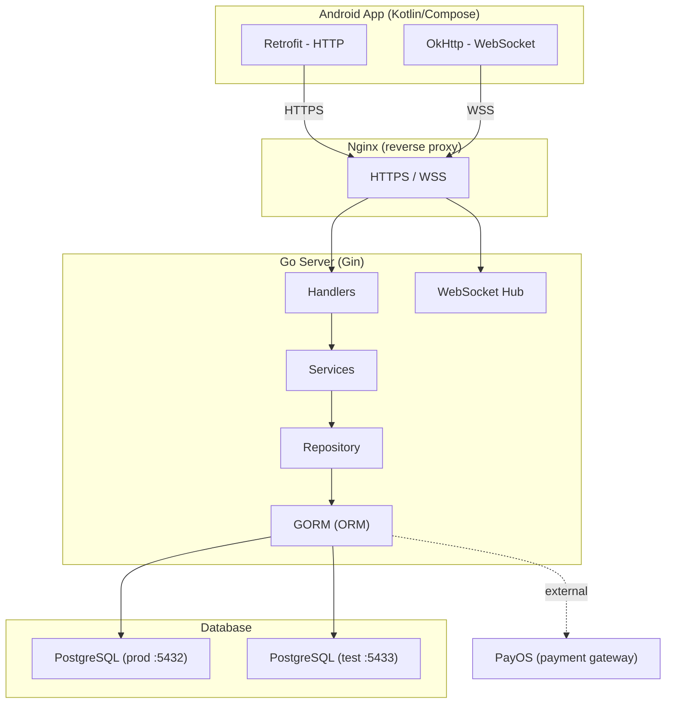

---

## 3. Tech Stack

| Layer        | Technology                                              |
|--------------|---------------------------------------------------------|
| Android UI   | Kotlin, Jetpack Compose, Material Design 3              |
| Android DI   | Hilt (Dagger)                                           |
| Android Net  | Retrofit + Moshi, OkHttp (HTTP + WebSocket)             |
| Android DB   | Room (local cache for tasks, categories, notifications) |
| Server       | Go 1.21+, Gin web framework                             |
| ORM          | GORM (PostgreSQL driver for prod + test)                |
| Auth         | JWT (HS256) via golang-jwt/jwt v5                       |
| WebSocket    | Gorilla WebSocket                                       |
| Payments     | PayOS (Vietnamese payment gateway)                      |
| Database     | PostgreSQL 15+ (prod :5432), PostgreSQL (test :5433, Docker tmpfs) |
| Config       | godotenv (.env) + OS environment variables              |

---

## 4. Server Architecture

### 4.1 Package Structure

```
server/
├── cmd/
│   ├── server/main.go        # Production entrypoint (PostgreSQL + real PayOS)
│   └── testserver/main.go    # Dev/E2E entrypoint (PostgreSQL test DB + mock PayOS)
├── internal/
│   ├── auth/                  # JWT generation, validation, middleware
│   ├── config/                # Env-based configuration
│   ├── database/              # GORM setup, AutoMigrate, seed data
│   ├── handlers/              # HTTP handlers (Gin)
│   ├── middleware/             # CORS
│   ├── models/                # Domain models + GORM tags + validation
│   ├── repository/            # Data access interfaces + GORM implementations
│   ├── services/              # Business logic
│   └── websocket/             # Hub + Client (real-time chat)
```

### 4.2 Layered Architecture

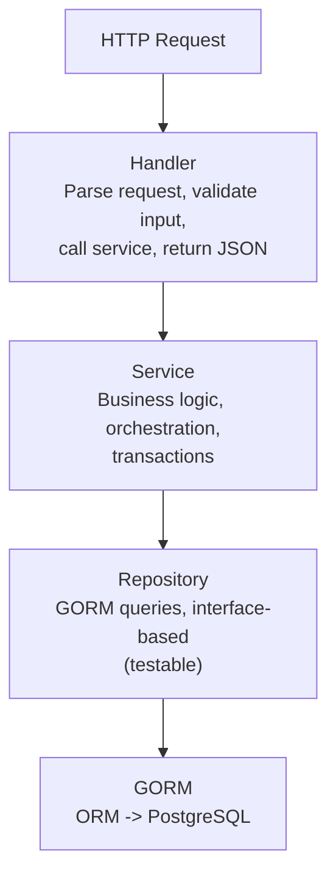

Each repository is defined as a Go interface (e.g. `UserRepository`, `TaskRepository`)
with a GORM-backed implementation (`UserGormRepository`, `TaskGormRepository`). This
allows swapping the data layer for testing. Both production and test servers use
PostgreSQL, ensuring identical code paths.

### 4.3 API Routes

All routes are under `/api/v1`.

**Public routes:**

| Method | Path                          | Description                |
|--------|-------------------------------|----------------------------|
| GET    | /health                       | Health check               |
| POST   | /auth/register                | Register new user          |
| POST   | /auth/login                   | Login, returns JWT pair    |
| POST   | /auth/refresh                 | Refresh access token       |
| GET    | /categories                   | List task categories       |
| GET    | /users/:id                    | Get user profile           |
| POST   | /payment/webhook              | PayOS webhook callback     |
| POST   | /payment/confirm-webhook      | PayOS webhook confirmation |

**Protected routes (JWT required via `Authorization: Bearer <token>`):**

| Method | Path                          | Description                     |
|--------|-------------------------------|---------------------------------|
| GET    | /users/me                     | Get current user profile        |
| PUT    | /users/me                     | Update profile                  |
| POST   | /users/become-tasker          | Upgrade to tasker role          |
| POST   | /tasks                        | Create a task                   |
| GET    | /tasks                        | List tasks (with filters)       |
| GET    | /tasks/:id                    | Get task details                |
| PUT    | /tasks/:id                    | Update task                     |
| DELETE | /tasks/:id                    | Delete task                     |
| POST   | /tasks/:id/applications       | Apply for a task                |
| GET    | /tasks/:id/applications       | List applications for a task    |
| POST   | /tasks/:id/complete           | Mark task as completed          |
| POST   | /applications/:id/accept      | Accept an application           |
| GET    | /wallet                       | Get wallet balance              |
| POST   | /wallet/deposit               | Initiate deposit (via PayOS)    |
| GET    | /wallet/transactions          | Wallet transaction history      |
| POST   | /payments/escrow              | Create escrow for a task        |
| POST   | /payments/release             | Release escrow to tasker        |
| POST   | /payments/refund              | Refund escrow to requester      |
| GET    | /ws?token=<jwt>               | WebSocket connection            |
| GET    | /conversations                | List user's conversations       |
| POST   | /conversations                | Create conversation for a task  |
| GET    | /conversations/:id/messages   | Get message history             |
| GET    | /notifications                | List notifications              |
| GET    | /notifications/unread-count   | Get unread count                |
| PUT    | /notifications/:id/read       | Mark as read                    |
| PUT    | /notifications/read-all       | Mark all as read                |
| DELETE | /notifications/:id            | Delete notification             |

### 4.4 Authentication Flow

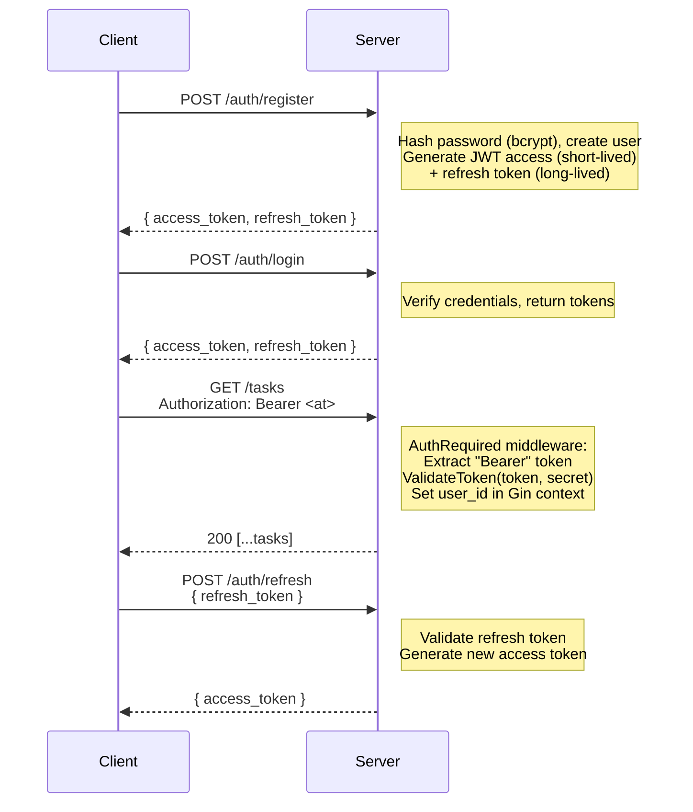

JWT claims contain: `sub` (user ID), `email`, `name`, `is_tasker`, standard
registered claims (exp, iat, nbf). Signed with HS256.

---

## 5. Domain Models & Database

### 5.1 Entity Relationship Diagram

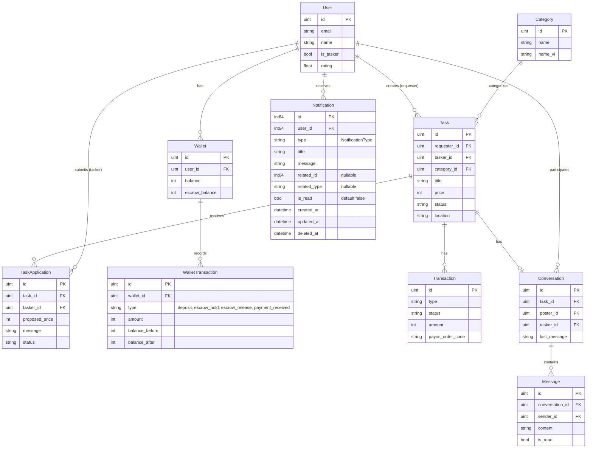

### 5.2 Key Models

**User** -- Email/password auth. Can be a requester (posts tasks) or a tasker
(applies for tasks). Has rating, university, optional skills/bio.

**Task** -- Created by a requester. Has category, title, description, price (VND),
location, status (`open` -> `in_progress` -> `completed` | `cancelled`).

**TaskApplication** -- A tasker's application to a task. Can include a proposed
price and message. Status: `pending` -> `accepted` | `rejected`.

**Wallet** -- One per user. Tracks `balance` (available) and `escrow_balance` (held).
Max balance enforced (default 200,000 VND).

**WalletTransaction** -- Immutable ledger of all wallet operations. Records
balance_before/after and escrow_before/after for auditability.

**Transaction** -- Payment transaction linking payer, payee, task. Tracks PayOS
order codes for external payments.

**Conversation** -- One-to-one chat between a task poster and an accepted tasker,
linked to a specific task.

**Message** -- Individual chat message within a conversation. Supports read receipts.

**Category** -- Bilingual (English + Vietnamese) task categories seeded on startup.

### 5.3 Status Machines

**Task lifecycle:**

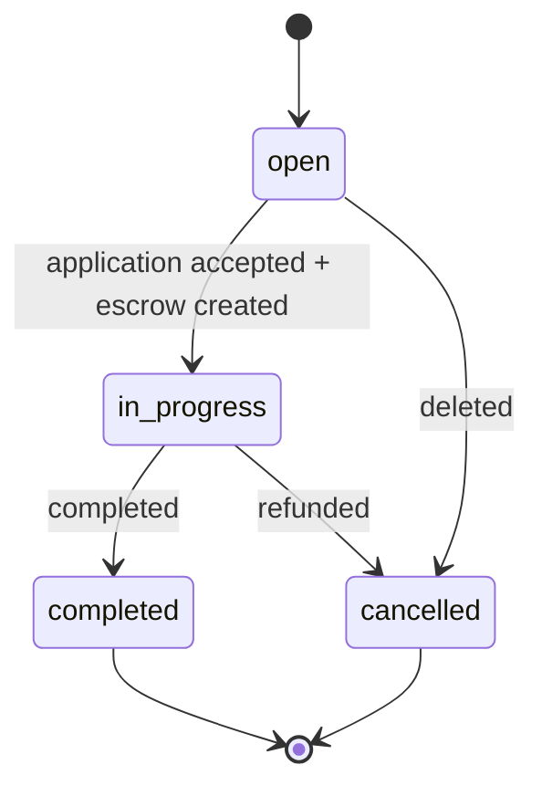

**Application lifecycle:**

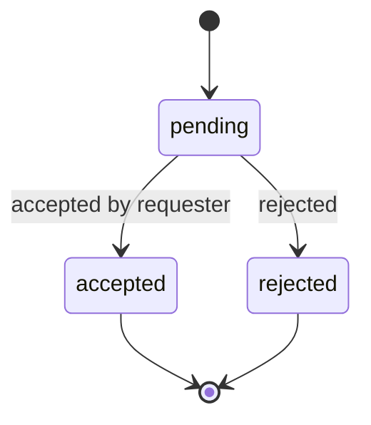

---

## 6. Payment & Escrow Flow

### 6.1 Wallet Deposit (via PayOS)

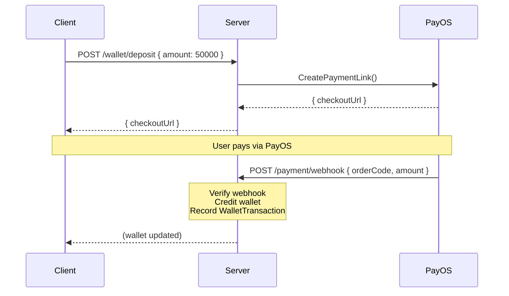

### 6.2 Task Escrow Flow

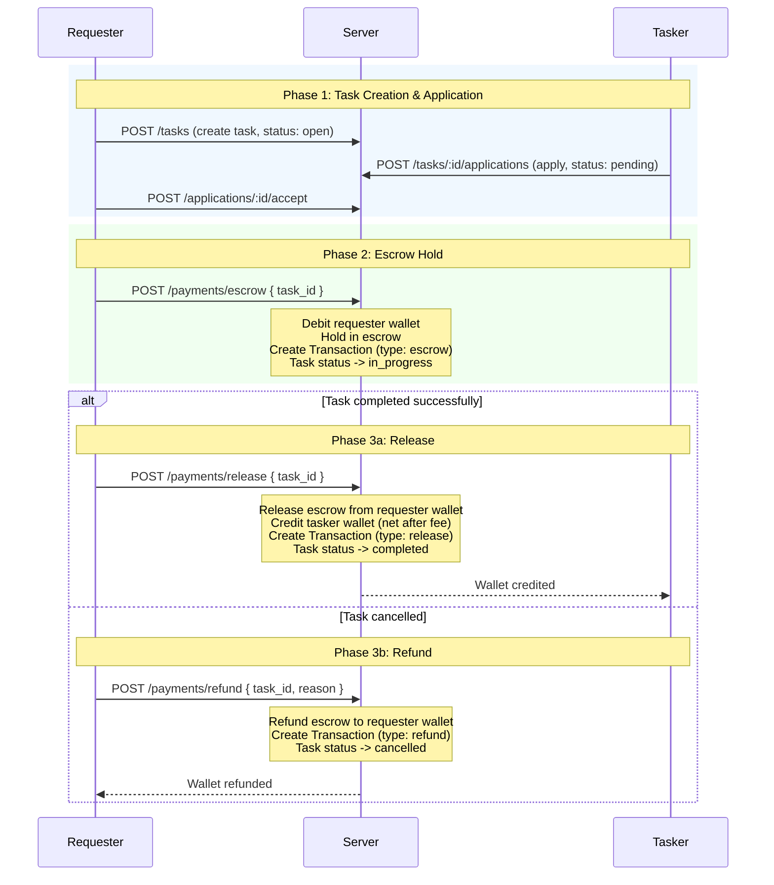

### 6.3 Mock vs Production Payment Mode

- **Production:** Real PayOS API calls for deposits. Escrow uses wallet balances.
- **Test server:** `mockPayOS` auto-fires a webhook 100ms after `CreatePaymentLink`,
  instantly crediting the wallet. `PAYMENT_MOCK_MODE=true` enables wallet-based
  escrow/release without real payment gateway calls.

---

## 7. WebSocket & Real-Time Chat

### 7.1 Architecture

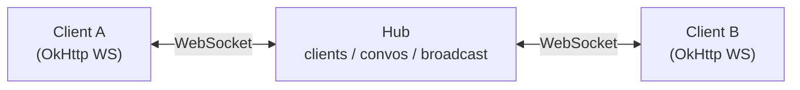

The **Hub** is a central goroutine that:
- Registers/unregisters WebSocket clients (keyed by user ID)
- Tracks which clients are in which conversation rooms
- Broadcasts messages to conversation participants (excluding sender)

Each **Client** has two goroutines:
- `readPump` -- reads incoming WebSocket messages, dispatches to `MessageService`
- `writePump` -- writes outgoing messages + periodic pings (54s interval, 60s timeout)

### 7.2 WebSocket Message Types

```json
// Client → Server
{ "type": "join",    "conversation_id": 1 }           // Join a conversation room
{ "type": "message", "conversation_id": 1, "content": "Hello" }  // Send chat message
{ "type": "typing",  "conversation_id": 1 }           // Typing indicator
{ "type": "read",    "conversation_id": 1 }           // Mark messages as read

// Server → Client
{ "type": "joined",         "conversation_id": 1 }    // Join confirmed
{ "type": "message_sent",   "conversation_id": 1, ... } // Send confirmed (to sender)
{ "type": "message",        "conversation_id": 1, ... } // New message (to recipient)
{ "type": "typing",         "conversation_id": 1, ... } // Typing indicator (to recipient)
{ "type": "read_confirmed", "conversation_id": 1 }    // Read receipt confirmed
{ "type": "error",          "error": "..." }           // Error
```

### 7.3 Message Flow

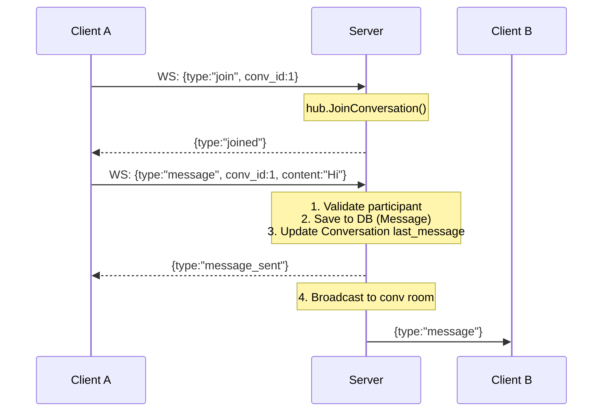

---

## 8. Android App Architecture

### 8.1 Package Structure

```
android/app/src/main/java/com/viecz/vieczandroid/
├── VieczApplication.kt          # @HiltAndroidApp
├── MainActivity.kt              # Single activity, hosts NavHost
├── data/
│   ├── api/                     # Retrofit API interfaces
│   │   ├── AuthApi.kt           #   POST /auth/register, /login, /refresh
│   │   ├── TaskApi.kt           #   CRUD /tasks, /applications
│   │   ├── CategoryApi.kt       #   GET /categories
│   │   ├── UserApi.kt           #   GET/PUT /users
│   │   ├── WalletApi.kt         #   GET/POST /wallet
│   │   ├── PaymentApi.kt        #   POST /payments/escrow, /release, /refund
│   │   ├── MessageApi.kt        #   GET/POST /conversations
│   │   ├── AuthInterceptor.kt   #   Injects Bearer token from TokenManager
│   │   └── ErrorResponse.kt     #   Error model
│   ├── auth/
│   │   └── AuthEventManager.kt  # Emits 401 events for global logout
│   ├── local/
│   │   ├── TokenManager.kt      # SharedPreferences for JWT tokens
│   │   ├── database/
│   │   │   ├── AppDatabase.kt   # Room database (tasks, categories, notifications)
│   │   │   └── Converters.kt    # Room type converters
│   │   ├── dao/                  # Room DAOs
│   │   └── entities/             # Room entities
│   ├── models/                   # API data classes (Task, User, Wallet, etc.)
│   ├── repository/               # Repository classes (API + optional Room cache)
│   └── websocket/
│       └── WebSocketClient.kt   # OkHttp WebSocket client, Moshi serialization
├── di/
│   ├── NetworkModule.kt         # Hilt: OkHttp, Retrofit, Moshi, API interfaces
│   └── DataModule.kt            # Hilt: TokenManager, Room DB, Repositories
├── ui/
│   ├── navigation/
│   │   └── Navigation.kt       # NavHost with all routes
│   ├── screens/                 # Composable screens
│   │   ├── SplashScreen.kt
│   │   ├── LoginScreen.kt
│   │   ├── RegisterScreen.kt
│   │   ├── MainScreen.kt       # Bottom nav container (Home, Chat, Profile tabs)
│   │   ├── HomeScreen.kt       # Task feed
│   │   ├── TaskDetailScreen.kt
│   │   ├── CreateTaskScreen.kt
│   │   ├── ApplyTaskScreen.kt
│   │   ├── WalletScreen.kt
│   │   ├── ChatScreen.kt
│   │   ├── ConversationListScreen.kt
│   │   ├── ProfileScreen.kt
│   │   ├── MyJobsScreen.kt
│   │   └── NotificationScreen.kt
│   ├── viewmodels/              # Hilt ViewModels with StateFlow
│   ├── components/              # Reusable composables (TaskCard, etc.)
│   └── theme/                   # Material 3 theme, colors, typography
└── utils/                       # Formatting, validation, HTTP error parsing
```

### 8.2 MVVM Data Flow

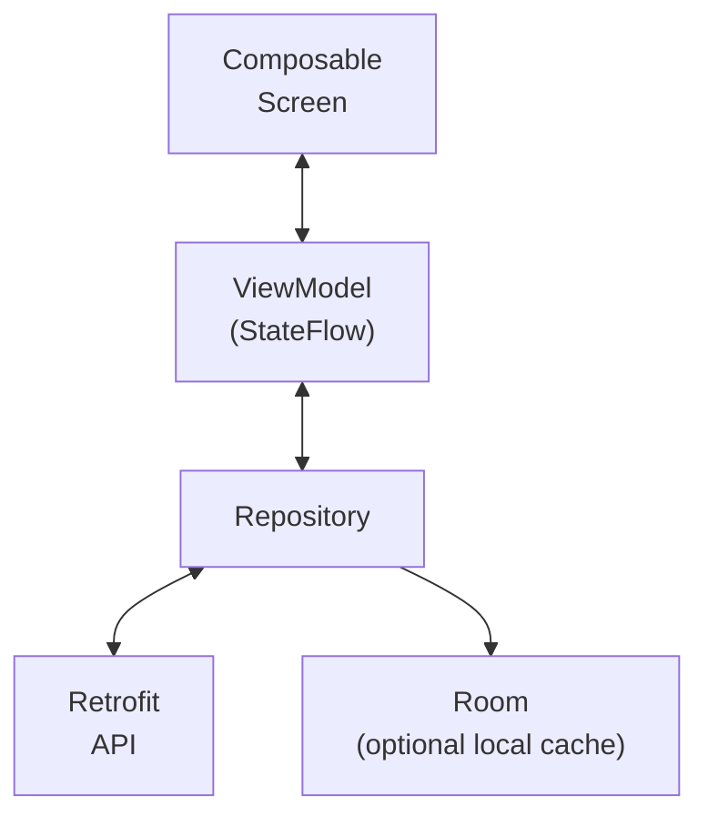

- **Screen** observes ViewModel `StateFlow` via `collectAsState()`
- **ViewModel** calls Repository methods, updates state
- **Repository** coordinates between Retrofit (remote) and Room (local cache)
- **Hilt** provides all dependencies via constructor injection

### 8.3 Navigation

Single-activity app with Jetpack Navigation Compose. Key routes:

```
splash → login ↔ register → main (bottom nav: home, conversations, profile)
                                    │
                                    ├── task_detail/{taskId}
                                    ├── create_task
                                    ├── apply_task/{taskId}/{price}
                                    ├── chat/{conversationId}
                                    ├── wallet
                                    ├── my_jobs/{mode}
                                    └── notifications
```

### 8.4 Product Flavors

| Flavor | API Base URL                        | App Name   | App ID Suffix |
|--------|-------------------------------------|------------|---------------|
| `dev`  | `http://10.0.2.2:9999/api/v1/`      | Viecz Dev  | `.dev`        |
| `prod` | Production server URL               | Viecz      | (none)        |

Both flavors can coexist on the same device.

---

## 9. Test Server

`server/cmd/testserver/main.go` provides a dev server that requires only a test PostgreSQL container:

- **PostgreSQL (port 5433, Docker tmpfs)** -- drops all tables on startup for fresh state; same DB engine as production
- **Mock PayOS** -- `CreatePaymentLink` auto-fires a webhook after 100ms to
  instantly credit the wallet
- **Port 9999** (hardcoded), JWT secret `e2e-test-secret-key`
- **Seed data** -- 11 categories + 2 test users (tasker-enabled)
- **Mock escrow** -- `PAYMENT_MOCK_MODE=true` for wallet-based escrow operations

**Prerequisite:** Start the test DB container: `docker compose -f docker-compose.testdb.yml up -d`

Used for: local Android development, E2E instrumented tests, manual API testing.

---

## 10. Key Design Decisions

| Decision | Rationale |
|----------|-----------|
| **Monolithic Go server** | MVP speed; single deployable binary |
| **GORM with interface repos** | Same PostgreSQL for prod and test; testable via interfaces |
| **Wallet-based escrow** | Simpler than real-time payment holds; no external escrow service |
| **WebSocket Hub pattern** | Standard Go concurrency pattern; scales to thousands of connections |
| **JWT access + refresh** | Stateless auth; short-lived access tokens for security |
| **Room local cache** | Offline-first for tasks/categories; reduces API calls |
| **Hilt DI** | Standard Android DI; integrates with ViewModel lifecycle |
| **Single-activity Compose** | Modern Android navigation; no fragment complexity |
| **PayOS for Vietnam** | Native VND support; QR code payments popular with students |
| **Max wallet balance** | Risk mitigation; configurable via `MAX_WALLET_BALANCE` env var |
