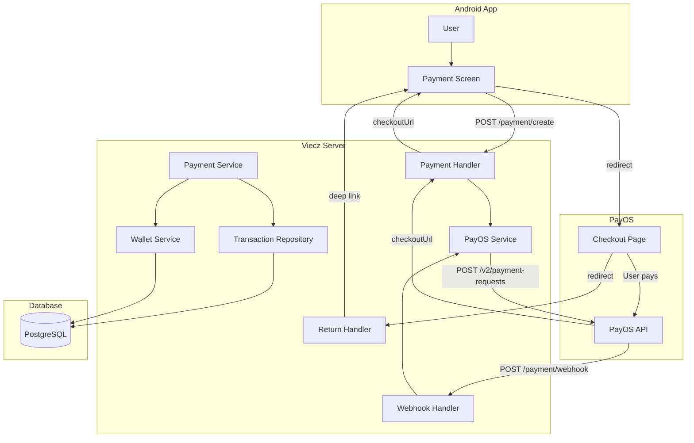
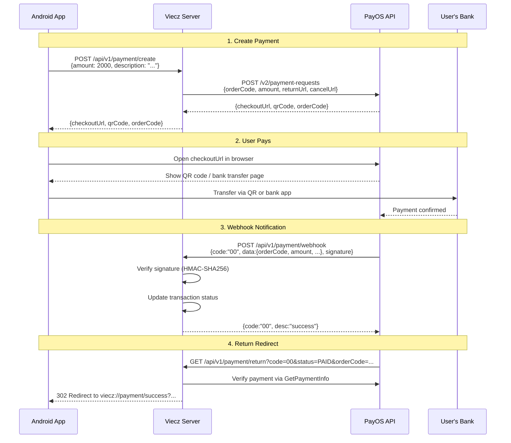
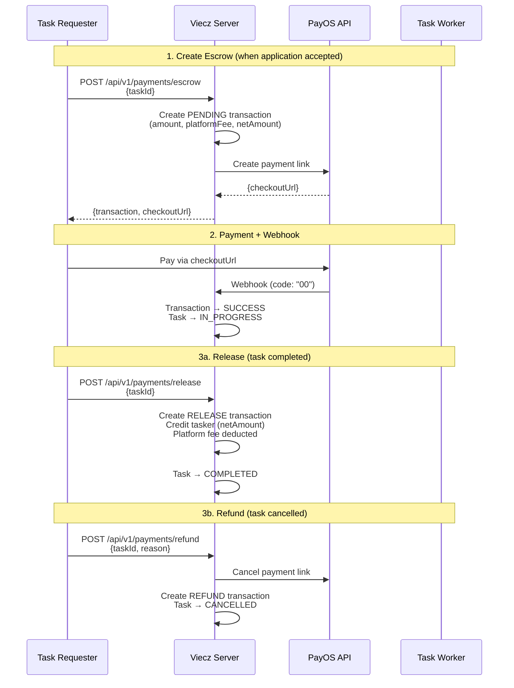
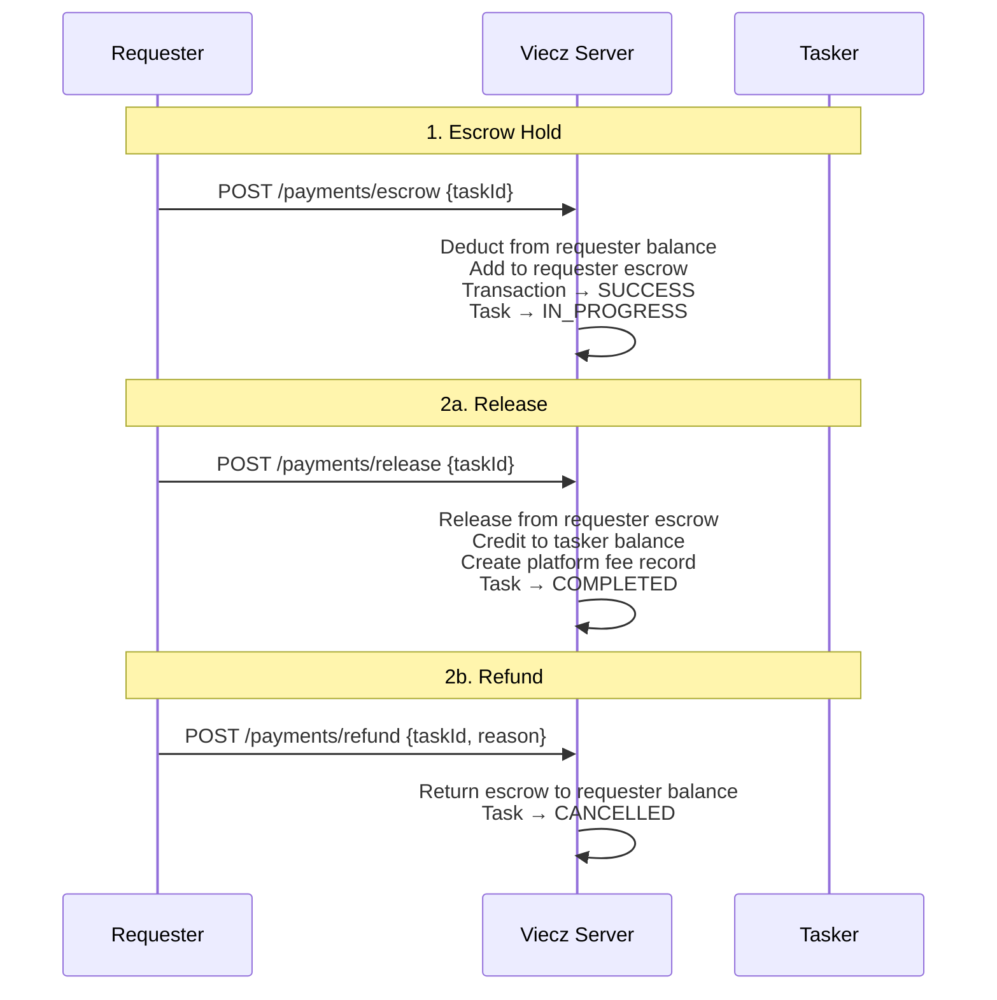
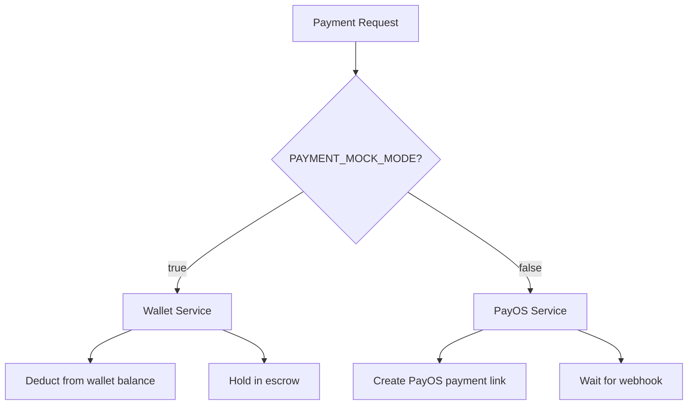

# PayOS Payment Integration - Technical Documentation

## Overview

PayOS is a Vietnamese payment gateway that creates payment links for bank transfers via QR code. This document covers the data structures, API flows, and implementation details for the Viecz server integration.

**Base URL:** `https://api-merchant.payos.vn`
**Go SDK:** `github.com/payOSHQ/payos-lib-golang/v2`

---

## Architecture

### System Components



### Payment Flow (Real Mode - PayOS)



### Escrow Payment Flow



### Mock Mode Flow (Wallet-based)



---

## Credentials

| Credential | Env Variable | Purpose |
|---|---|---|
| Client ID | `PAYOS_CLIENT_ID` | Merchant account identifier |
| API Key | `PAYOS_API_KEY` | API authentication (sent in headers) |
| Checksum Key | `PAYOS_CHECKSUM_KEY` | HMAC-SHA256 signature generation/verification |

Obtain from [my.payos.vn](https://my.payos.vn) dashboard.

---

## Data Structures

### PayOS API Request (Create Payment Link)

```json
{
  "orderCode": 1770653571287,
  "amount": 2000,
  "description": "Payment description",
  "returnUrl": "https://viecz-api-dev.fishcmus.io.vn/api/v1/payment/return",
  "cancelUrl": "https://viecz-api-dev.fishcmus.io.vn/api/v1/payment/return",
  "signature": "auto-generated-by-sdk"
}
```

| Field | Type | Required | Description |
|---|---|---|---|
| `orderCode` | int64 | Yes | Unique order code (we use millisecond timestamp) |
| `amount` | int | Yes | Amount in VND (minimum 2000) |
| `description` | string | Yes | Shown on checkout page |
| `returnUrl` | string | Yes | Redirect URL after successful payment |
| `cancelUrl` | string | Yes | Redirect URL after cancelled payment |
| `buyerName` | string | No | Buyer's name |
| `buyerEmail` | string | No | Buyer's email |
| `buyerPhone` | string | No | Buyer's phone |
| `items` | array | No | List of items `{name, quantity, price}` |
| `expiredAt` | int | No | Expiration Unix timestamp |

### PayOS API Response (Payment Link Created)

```json
{
  "code": "00",
  "desc": "success",
  "data": {
    "bin": "970422",
    "accountNumber": "232306989",
    "accountName": "QUY VAC XIN",
    "amount": 2000,
    "description": "CSRDKJR9R33 Payment description",
    "orderCode": 1770653571287,
    "currency": "VND",
    "paymentLinkId": "fdc29c27637b4f94bce5a7dfacd817a0",
    "status": "PENDING",
    "checkoutUrl": "https://pay.payos.vn/web/fdc29c27637b4f94bce5a7dfacd817a0",
    "qrCode": "00020101021238600010A000000727..."
  }
}
```

### Webhook Payload (PayOS → Server)

PayOS sends this to `POST /api/v1/payment/webhook`:

```json
{
  "code": "00",
  "desc": "success",
  "success": true,
  "data": {
    "orderCode": 1770653571287,
    "amount": 2000,
    "description": "CSRDKJR9R33 Webhook test 2000 VND",
    "accountNumber": "232306989",
    "reference": "3059",
    "transactionDateTime": "2026-02-09 23:13:24",
    "currency": "VND",
    "paymentLinkId": "fdc29c27637b4f94bce5a7dfacd817a0",
    "code": "00",
    "desc": "success",
    "counterAccountBankId": "",
    "counterAccountBankName": "TMCP Quan Doi",
    "counterAccountName": "MBBANK IBFT",
    "counterAccountNumber": "9704229200335033154",
    "virtualAccountName": "NGUYEN HUU THIEN NHAN",
    "virtualAccountNumber": "LOCCASS000336657"
  },
  "signature": "412e915d2871504ed31be63c8f62a149..."
}
```

#### Webhook Data Fields

| Field | Type | Description |
|---|---|---|
| `orderCode` | int64 | Your order code |
| `amount` | int | Amount paid in VND |
| `description` | string | Transaction description |
| `accountNumber` | string | Receiving account number |
| `reference` | string | Bank transaction reference |
| `transactionDateTime` | string | Format: `YYYY-MM-DD HH:MM:SS` |
| `currency` | string | Always `"VND"` |
| `paymentLinkId` | string | PayOS payment link ID |
| `code` | string | `"00"` = success, `"01"` = cancelled |
| `desc` | string | Status description |
| `counterAccountBankId` | string | Payer's bank ID |
| `counterAccountBankName` | string | Payer's bank name |
| `counterAccountName` | string | Payer's account name |
| `counterAccountNumber` | string | Payer's account number |
| `virtualAccountName` | string | Virtual account name |
| `virtualAccountNumber` | string | Virtual account number |

#### Required Webhook Response

```json
{
  "code": "00",
  "desc": "success"
}
```

### Return URL Query Parameters

PayOS redirects the user's browser to `returnUrl` with these params:

```
GET /api/v1/payment/return?code=00&id=fdc29c27...&cancel=false&status=PAID&orderCode=1770653571287
```

| Parameter | Type | Description |
|---|---|---|
| `code` | string | `"00"` = success, `"01"` = error |
| `id` | string | PayOS payment link ID |
| `cancel` | string | `"true"` if cancelled, `"false"` otherwise |
| `status` | string | `PAID`, `CANCELLED`, `PENDING`, `PROCESSING` |
| `orderCode` | string | Your order code |

Our server redirects to Android deep links:
- Success: `viecz://payment/success?orderCode=...&amount=...&status=PAID`
- Cancelled: `viecz://payment/cancelled?orderCode=...`
- Error: `viecz://payment/error?orderCode=...`

---

## Payment Statuses

### PayOS Payment Link Status

| Status | Description |
|---|---|
| `PENDING` | Payment link created, awaiting payment |
| `PROCESSING` | Payment being processed |
| `PAID` | Payment completed |
| `CANCELLED` | Cancelled by user or merchant |
| `EXPIRED` | Past `expiredAt` timestamp |
| `UNDERPAID` | Partial payment received |
| `FAILED` | Payment processing failed |

### Internal Transaction Status

| Status | Description |
|---|---|
| `pending` | Transaction created, awaiting payment |
| `success` | Payment verified and completed |
| `failed` | Payment processing failed |
| `cancelled` | Payment cancelled |

### Internal Transaction Types

| Type | Description |
|---|---|
| `escrow` | Funds held for task (payer → escrow) |
| `release` | Funds released to tasker (escrow → payee) |
| `refund` | Funds returned to payer (escrow → payer) |
| `platform_fee` | Platform commission deducted |
| `deposit` | Wallet top-up (mock mode) |
| `withdrawal` | Wallet withdrawal (mock mode) |

---

## Signature Verification

### Algorithm

HMAC-SHA256 using `checksumKey`.

### For Webhook Verification

1. Extract `data` object from webhook payload
2. Sort all keys alphabetically
3. Join as `key1=value1&key2=value2&...` (empty string for null values)
4. Compute `HMAC_SHA256(checksumKey, dataString)`
5. Compare with `signature` field

The Go SDK handles this automatically via `Webhooks.VerifyData()`.

**Critical:** `VerifyData()` returns the **inner `data` object**, not the full webhook wrapper. Access fields like `orderCode` and `code` directly from the result.

```go
// CORRECT
verifiedData, err := payos.VerifyWebhookData(ctx, webhookBody)
orderCode := verifiedData["orderCode"] // direct access

// WRONG (double-nesting)
data := verifiedData["data"].(map[string]interface{})
orderCode := data["orderCode"] // this is nil
```

---

## API Endpoints

### Public Endpoints

| Method | Path | Handler | Description |
|---|---|---|---|
| POST | `/api/v1/payment/create` | `PaymentHandler.CreatePayment` | Create a payment link |
| GET | `/api/v1/payment/return` | `ReturnHandler.HandleReturn` | PayOS return redirect |
| POST | `/api/v1/payment/webhook` | `WebhookHandler.HandleWebhook` | PayOS webhook receiver |
| POST | `/api/v1/payment/confirm-webhook` | `WebhookHandler.ConfirmWebhook` | Register webhook URL |

### Protected Endpoints (JWT required)

| Method | Path | Handler | Description |
|---|---|---|---|
| POST | `/api/v1/payments/escrow` | `PaymentHandler.CreateEscrowPayment` | Create escrow payment for task |
| POST | `/api/v1/payments/release` | `PaymentHandler.ReleasePayment` | Release funds to tasker |
| POST | `/api/v1/payments/refund` | `PaymentHandler.RefundPayment` | Refund funds to requester |
| GET | `/api/v1/wallet` | `WalletHandler.GetWallet` | Get user wallet |
| POST | `/api/v1/wallet/deposit` | `WalletHandler.Deposit` | Deposit to wallet |
| GET | `/api/v1/wallet/transactions` | `WalletHandler.GetTransactionHistory` | Wallet transaction history |

---

## Internal Data Models

### Transaction (PostgreSQL)

```go
type Transaction struct {
    ID               int64      // auto-increment PK
    TaskID           int64      // reference to task
    PayerID          int64      // user paying
    PayeeID          *int64     // user receiving (nullable)
    Amount           float64    // full amount
    PlatformFee      float64    // platform cut (default 0)
    NetAmount        float64    // amount after fee (auto-calculated)
    Type             string     // escrow|release|refund|platform_fee|deposit|withdrawal
    Status           string     // pending|success|failed|cancelled
    PayOSOrderCode   *int64     // PayOS order code
    PayOSPaymentID   *string    // PayOS payment link ID
    Description      string     // transaction details
    FailureReason    *string    // error details if failed
    CompletedAt      *time.Time // completion timestamp
    CreatedAt        time.Time
    UpdatedAt        time.Time
}
```

### Wallet (PostgreSQL)

```go
type Wallet struct {
    ID             int64   // auto-increment PK
    UserID         int64   // unique per user
    Balance        float64 // available funds
    EscrowBalance  float64 // funds held in escrow
    TotalDeposited float64 // lifetime deposits
    TotalWithdrawn float64 // lifetime withdrawals
    TotalEarned    float64 // lifetime earnings
    TotalSpent     float64 // lifetime spending
}
```

### WalletTransaction (PostgreSQL)

```go
type WalletTransaction struct {
    ID              int64   // auto-increment PK
    WalletID        int64   // reference to wallet
    TransactionID   *int64  // reference to transaction
    TaskID          *int64  // reference to task
    Type            string  // deposit|withdrawal|escrow_hold|escrow_release|escrow_refund|payment_received|platform_fee
    Amount          float64 // transaction amount
    BalanceBefore   float64 // balance before
    BalanceAfter    float64 // balance after
    EscrowBefore    float64 // escrow balance before
    EscrowAfter     float64 // escrow balance after
    Description     string  // details
    ReferenceUserID *int64  // other party in transaction
}
```

---

## Dual-Mode Architecture

The payment system operates in two modes controlled by `PAYMENT_MOCK_MODE` environment variable:



| Feature | Mock Mode (Wallet) | Real Mode (PayOS) |
|---|---|---|
| **Escrow** | Deduct from wallet balance | Create PayOS checkout link |
| **Release** | Transfer wallet balance payer→payee | Platform fee already deducted |
| **Refund** | Return escrow to wallet balance | Cancel PayOS payment link |
| **Platform Fee** | Separate wallet transaction | Deducted at PayOS level |
| **Use Case** | Development, testing | Production |

---

## Go SDK Quick Reference

```go
import "github.com/payOSHQ/payos-lib-golang/v2"

// Initialize client
client, _ := payos.NewPayOS(&payos.PayOSOptions{
    ClientId:    os.Getenv("PAYOS_CLIENT_ID"),
    ApiKey:      os.Getenv("PAYOS_API_KEY"),
    ChecksumKey: os.Getenv("PAYOS_CHECKSUM_KEY"),
})

// Create payment link (signature auto-generated by SDK)
resp, _ := client.PaymentRequests.Create(ctx, payos.CreatePaymentLinkRequest{
    OrderCode:   orderCode,
    Amount:      2000,
    Description: "Test payment",
    ReturnUrl:   "https://example.com/return",
    CancelUrl:   "https://example.com/cancel",
})
// resp.CheckoutUrl, resp.QrCode, resp.PaymentLinkId

// Get payment info
info, _ := client.PaymentRequests.Get(ctx, orderCode)
// info.Status, info.Amount, info.AmountPaid

// Cancel payment link
reason := "User requested cancellation"
_, _ = client.PaymentRequests.Cancel(ctx, orderCode, &reason)

// Verify webhook data (returns inner "data" object)
verified, _ := client.Webhooks.VerifyData(ctx, webhookBody)
// verified["orderCode"], verified["code"], verified["amount"]

// Confirm webhook URL
url, _ := client.Webhooks.Confirm(ctx, "https://your-domain.com/webhook")
```

---

## Environment Variables

| Variable | Default | Description |
|---|---|---|
| `PAYOS_CLIENT_ID` | (required) | PayOS client ID |
| `PAYOS_API_KEY` | (required) | PayOS API key |
| `PAYOS_CHECKSUM_KEY` | (required) | PayOS checksum key |
| `SERVER_URL` | `http://localhost:8080` | Server URL for return/cancel URLs |
| `CLIENT_URL` | `http://localhost:8081` | Client URL for deep links |
| `PAYMENT_MOCK_MODE` | `false` | Use wallet instead of PayOS |

---

## Webhook URL Configuration

### Register via API

```bash
curl -X POST https://viecz-api-dev.fishcmus.io.vn/api/v1/payment/confirm-webhook \
  -H 'Content-Type: application/json' \
  -d '{"webhook_url": "https://viecz-api-dev.fishcmus.io.vn/api/v1/payment/webhook"}'
```

### Register via PayOS Dashboard

1. Go to [my.payos.vn](https://my.payos.vn)
2. Select your channel
3. Set webhook URL: `https://viecz-api-dev.fishcmus.io.vn/api/v1/payment/webhook`

---

## Testing

### Create a Test Payment

```bash
# 1. Login
TOKEN=$(curl -s -X POST http://localhost:8080/api/v1/auth/login \
  -H 'Content-Type: application/json' \
  -d '{"email":"nhannht.alpha@gmail.com","password":"Password123"}' \
  | python3 -c "import sys,json; print(json.load(sys.stdin)['access_token'])")

# 2. Create payment (2000 VND minimum)
curl -s -X POST http://localhost:8080/api/v1/payment/create \
  -H 'Content-Type: application/json' \
  -H "Authorization: Bearer $TOKEN" \
  -d '{"amount":2000,"description":"Test payment"}'

# 3. Open checkoutUrl in browser, complete payment
# 4. Check server logs for webhook
grep -i webhook server/server.log
```

### Test Webhook Endpoint Directly

```bash
# Should return signature verification error (expected)
curl -X POST http://localhost:8080/api/v1/payment/webhook \
  -H 'Content-Type: application/json' \
  -d '{"test":"ping"}'
# Response: {"code":"01","desc":"Invalid webhook signature"}
```

### Test Return URL

```bash
# Simulates PayOS redirect after payment
curl -v "http://localhost:8080/api/v1/payment/return?code=00&id=test&cancel=false&status=PAID&orderCode=123"
# Response: 302 redirect to viecz://payment/success?...
```

---

## Known Gotchas

1. **SDK VerifyData returns inner data**: `Webhooks.VerifyData()` returns the `data` object, not the full wrapper. Access `orderCode` directly, not via `data["data"]`.

2. **Webhook response format**: PayOS expects `{"code":"00","desc":"success"}`, not a custom format.

3. **Route naming**: Payment routes use singular `/payment/` (public), escrow routes use plural `/payments/` (protected).

4. **Minimum amount**: PayOS requires minimum 2000 VND per payment.

5. **Return URL is client-side**: The return redirect happens in the user's browser. Always use webhooks for server-side payment confirmation.

6. **orderCode as float64**: When parsing webhook JSON in Go, `orderCode` comes as `float64` due to JSON number handling. Cast with `int64(orderCode)`.
